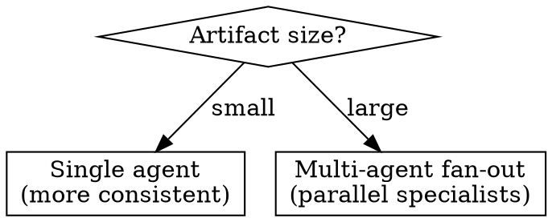

# Evaluator

Abstract pattern: **Artifact In → Criteria Check → Structured Feedback**

A read-only agent that receives an artifact, applies structured criteria, and emits a verdict without mutating the artifact or external state. Always idempotent.

## When to Use

- User says "review PRs automatically"
- User says "check compliance against our policy"
- User says "grade submissions against a rubric"
- User says "add a quality gate to our pipeline"
- User describes any evaluate/score/audit workflow
- Key distinction from transformer: evaluator READS, never WRITES the artifact

## Pre-filled Configuration

```yaml
model: claude-sonnet-4-6
tools:
  - type: agent_toolset_20260401
    default_config:
      enabled: false                    # start with everything off
    configs:
      - name: read
        enabled: true
      - name: glob
        enabled: true
      - name: grep
        enabled: true
      - name: web_fetch
        enabled: true                   # for fetching artifacts from URLs
mcp_servers: []                         # user provides artifact source MCP
environment:
  networking: {type: limited}
  packages: {}
```

Read-only by design: `bash`, `write`, `edit` disabled. The evaluator cannot modify what it reviews.

## Questions to Ask (replaces Phase 1)

| # | Question | Why | Example answers |
|---|---|---|---|
| 1 | Name? | Agent identity | "pr-reviewer", "soc2-checker", "essay-grader" |
| 2 | What artifact does it evaluate? | Shapes tool config + context | "Code diff on PR", "PDF policy doc", "JSON config" |
| 3 | Where does the artifact come from? | MCP server or resource mount | "GitHub PR", "uploaded file", "S3 bucket" |
| 4 | MCP server URL for artifact source? | Wires mcp-vaults-expert | `https://api.githubcopilot.com/mcp/` |
| 5 | Auth for artifact source? | Credential type for vault | "GitHub PAT", "OAuth", "none" |
| 6 | What criteria/rubric? | Core evaluation logic | Checklist, severity-ranked, weighted scoring, compliance controls |
| 7 | Provide the rubric content | Inline text or file upload | Markdown checklist, scoring matrix, control mapping |
| 8 | Hard gate or advisory? | Determines if verdict blocks action | Hard = blocks merge/deploy, Advisory = informational |
| 9 | Create new or update existing? | Agent mode | "create new", "update agt_01abc123" |
| 10 | Where to post the verdict? | Delivery channel | "PR review comment", "Slack", "JSON to CI" |
| 11 | Delivery MCP URL? | Wires delivery MCP | `https://api.githubcopilot.com/mcp/` (or "same as source") |
| 12 | Auth for delivery? | Delivery vault credential | "GitHub PAT", "Slack bot token", "same as source" |

## Specialist Dispatch Order

```
1. mcp-vaults-expert                      — vault + credentials for source and delivery
2. agents-expert + environments-expert    — parallel: agent (read-only tools) + container
3. sessions-expert                        — session with agent + environment + vault
4. events-expert                          — outcome-based validation with the rubric
```

## Architecture Decision



Per Anthropic research: a single agent with a well-structured rubric is more consistent than multiple specialized judges. Use multi-agent only for large artifacts.

## System Prompt Template

```
You are an evaluator agent. You review [ARTIFACT_TYPE] against the following criteria.

Your role is READ-ONLY. You never modify the artifact. You produce a structured verdict.

## Criteria
[RUBRIC_CONTENT]

## Output format
For each criterion:
- criterion: [name]
- passed: true/false
- severity: critical/high/medium/low/nit
- rationale: [why]
- location: [file:line if applicable]

Summary: overall verdict (PASS / FAIL / ESCALATE) with explanation.

## Escalation
If your confidence is low or findings are borderline, set verdict to ESCALATE
with a clear explanation of what needs human judgment.
```

## Agent Spec Output

```json
{
  "mode": "create",
  "name": "[user-provided]",
  "model": "claude-sonnet-4-6",
  "system": "[generated from template with rubric embedded]",
  "tools": [
    {
      "type": "agent_toolset_20260401",
      "default_config": {"enabled": false},
      "configs": [
        {"name": "read", "enabled": true},
        {"name": "glob", "enabled": true},
        {"name": "grep", "enabled": true},
        {"name": "web_fetch", "enabled": true}
      ]
    },
    {"type": "mcp_toolset", "mcp_server_name": "[source]"},
    {"type": "mcp_toolset", "mcp_server_name": "[delivery]"}
  ],
  "mcp_servers": [
    {"type": "url", "name": "[source]", "url": "[source_mcp_url]"},
    {"type": "url", "name": "[delivery]", "url": "[delivery_mcp_url]"}
  ],
  "environment": {
    "name": "[name]-env",
    "config": {
      "type": "cloud",
      "packages": {},
      "networking": {
        "type": "limited",
        "allowed_hosts": ["https://[source_host]", "https://[delivery_host]"],
        "allow_mcp_servers": true,
        "allow_package_managers": false
      }
    }
  },
  "vault_ids": ["[created by mcp-vaults-expert]"],

  "_orchestration (not sent to API)": {
    "smoke_test_prompt": "Here is a sample [ARTIFACT_TYPE]. Evaluate it against your criteria and produce a structured verdict.",
    "outcome": {
      "description": "Evaluate [ARTIFACT_TYPE] against the provided rubric",
      "rubric": {"type": "text", "content": "[RUBRIC_CONTENT]"},
      "max_iterations": 1
    }
  }
}
```

Note: The `_orchestration` block is design-time metadata used by lead-0 in Phase 4. It is NOT sent to the agent creation API. `outcome` is sent as a `user.define_outcome` event via events-expert. `smoke_test_prompt` is sent as a `user.message` event.

## Safety Defaults

- `bash`, `write`, `edit`: **disabled** — evaluator is read-only
- `web_search`: disabled (evaluator works with provided artifacts, not web searches)
- `networking`: `limited` — only source/delivery hosts
- MCP toolset: `always_ask` (default)
- Verdict posted as draft/comment, never auto-merged or auto-applied
- ESCALATE verdict when confidence is low

## Common Instantiations

| Use case | Artifact | Criteria | Output |
|---|---|---|---|
| Code reviewer | PR diff | Correctness, security, style, perf | PR review comments |
| Compliance checker | Config/policy doc | SOC2/HIPAA controls | Control-mapped score |
| Quality gate | PR + test results | Coverage, lint, build status | Pass/fail for CI |
| Document reviewer | Contract/RFP | Requirements checklist | Annotated findings |
| Rubric grader | Text/code submission | Weighted scoring matrix | Per-criterion scores |
