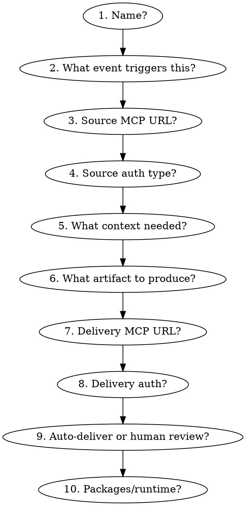

# Reactive Pipeline

Abstract pattern: **Event → Agent → Artifact → Delivery**

An agent that activates in response to an external event, processes it with context enrichment, produces an artifact, and delivers it back — without human prompting.

## When to Use

- User says "when a bug is reported, automatically fix it"
- User says "when a PR is opened, review it"
- User says "when a ticket comes in, draft a response"
- User describes any trigger→action automation
- User mentions webhooks, alerts, GitHub Actions, scheduled tasks

## Pre-filled Configuration

```yaml
model: claude-sonnet-4-6           # Sonnet for balanced speed/quality
tools:
  - type: agent_toolset_20260401
    configs:
      - name: bash
        permission_policy: {type: always_ask}  # human approves shell commands
mcp_servers: []                     # user provides trigger source MCP
environment:
  networking: {type: limited}       # restricted to allowed_hosts only
  packages: {}                      # user specifies per language
```

## Questions to Ask (replaces Phase 1)

Only these — skip all other Phase 1 questions:



| # | Question | Why | Example answers |
|---|---|---|---|
| 1 | Name for this agent? | Agent identity | "sentry-fixer", "pr-reviewer", "ticket-responder" |
| 1b | Create or update existing? | Agent mode | "create new", "update agt_01abc123" |
| 2 | What event triggers this? | Determines MCP + filter config | "Sentry issue created", "PR opened", "ticket created" |
| 3 | MCP server URL for event source? | Wires mcp-vaults-expert | `https://mcp.sentry.io/`, `https://api.githubcopilot.com/mcp/` |
| 4 | Auth for event source? (OAuth, API key, or none) | Credential type for vault | "OAuth with refresh", "static API key", "none" |
| 5 | What context does the agent need? | Additional MCP servers or resources | "GitHub repo for code context", "knowledge base for replies" |
| 6 | What artifact should it produce? | Shapes system prompt + tools | "Pull request with fix", "ticket reply draft", "Slack summary" |
| 7 | Delivery MCP server URL? | Wires delivery channel | `https://api.githubcopilot.com/mcp/`, `https://mcp.slack.com/mcp` |
| 8 | Auth for delivery target? | Credential for delivery vault | "GitHub PAT", "Slack bot token", "same as source" |
| 9 | Auto-deliver or human review? | Sets permission policy | Auto = `always_allow`, Review = `always_ask` on writes |
| 10 | Packages/runtime needed? | Environment config | "pip: [pytest, flask]", "npm: [typescript]" |

## Specialist Dispatch Order

```
1. mcp-vaults-expert                      — create vault + credentials for source and delivery
2. agents-expert + environments-expert    — parallel: agent definition + container config
3. sessions-expert                        — create session (needs agent + environment + vault IDs)
4. events-expert                          — send smoke test event, stream response, validate
```

## System Prompt Template

Lead-0 drafts this based on user answers, then confirms:

```
You are a reactive agent that responds to [EVENT_TYPE] events from [SOURCE].

When triggered:
1. Parse the incoming event
2. Enrich with context from [CONTEXT_SOURCES]
3. [PROCESSING_STEPS based on artifact type]
4. Produce [ARTIFACT_TYPE]
5. Deliver to [DELIVERY_TARGET]

Guardrails:
- Never auto-merge pull requests
- Never modify [PROTECTED_PATHS]
- If confidence is low, explain what you found and ask for human guidance
- Maximum [MAX_FILES] files changed per run
```

## Agent Spec Output

The skill produces this in `agent-specs.json`:

```json
{
  "mode": "create",
  "name": "[user-provided]",
  "model": "claude-sonnet-4-6",
  "system": "[generated from template]",
  "tools": [
    {
      "type": "agent_toolset_20260401",
      "configs": [
        {"name": "bash", "permission_policy": {"type": "always_ask"}}
      ]
    },
    {"type": "mcp_toolset", "mcp_server_name": "[source]"},
    {"type": "mcp_toolset", "mcp_server_name": "[delivery]"}
  ],
  "mcp_servers": [
    {"type": "url", "name": "[source]", "url": "[source_mcp_url]"},
    {"type": "url", "name": "[delivery]", "url": "[delivery_mcp_url]"}
  ],
  "environment": {
    "name": "[name]-env",
    "config": {
      "type": "cloud",
      "packages": {},
      "networking": {
        "type": "limited",
        "allowed_hosts": ["https://[source_host]", "https://[delivery_host]"],
        "allow_mcp_servers": true,
        "allow_package_managers": true
      }
    }
  },
  "vault_ids": ["[created by mcp-vaults-expert]"],

  "_orchestration (not sent to API)": {
    "smoke_test_prompt": "Simulate receiving a [EVENT_TYPE] event and walk through what you would do. Do not make real API calls."
  }
}
```

## Safety Defaults

- `bash`: `always_ask` — human approves shell commands
- `networking`: `limited` — only allowed_hosts
- MCP toolset: `always_ask` (default) — human approves external tool calls on first use
- Never auto-merge PRs
- Never modify `.env`, secrets, or governance files
- Smoke test is simulation-only (no real external calls)

## Common Instantiations

| Use case | Event | Artifact | Delivery |
|---|---|---|---|
| Issue-to-PR | Sentry alert / GitHub issue | Code fix + tests | Pull request |
| PR reviewer | PR opened | Review comments | PR review |
| Support responder | Ticket created | Draft reply | Ticket comment (draft) |
| Alert enricher | PagerDuty incident | Analysis brief | Slack message |
| CI fixer | Workflow failed | Code fix + commit | Push to branch |
| Triager | Issue/ticket created | Labels + routing | Issue update |
