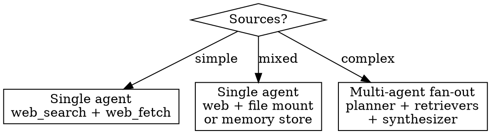

# Researcher

Abstract pattern: **Question → Multi-Source Gathering → Synthesis → Report**

An agent that receives a question or topic, searches across multiple sources (web, internal docs, APIs, databases), synthesizes findings, and produces a structured report with citations.

## When to Use

- User says "research X and write a report"
- User says "monitor competitors weekly"
- User says "generate documentation for this codebase"
- User says "analyze the market for Y"
- User describes any gather→synthesize→report workflow
- Key distinction from evaluator: researcher DISCOVERS information, evaluator CHECKS against known criteria

## Architecture Decision



Single agent is sufficient for most research tasks. Multi-agent fan-out only when researching 5+ independent sub-topics in parallel.

## Pre-filled Configuration

```yaml
model: claude-sonnet-4-6
tools:
  - type: agent_toolset_20260401
    configs:
      - name: bash
        enabled: false                  # researcher reads, doesn't execute
      - name: edit
        enabled: false
      - name: web_search
        enabled: true                   # core capability
      - name: web_fetch
        enabled: true                   # fetch full pages
mcp_servers: []
environment:
  networking: {type: unrestricted}      # web access required
  packages: {}
```

## Questions to Ask (replaces Phase 1)

| # | Question | Why | Example answers |
|---|---|---|---|
| 1 | Name? | Agent identity | "market-researcher", "competitor-monitor", "docs-generator" |
| 2 | Create or update existing? | Agent mode | "create new", "update agt_01abc123" |
| 3 | What is the research question/topic? | Core task | "Competitive landscape for AI agent frameworks", "Document the payments API" |
| 4 | One-shot or recurring? | Determines if scheduled | "One-shot report", "Weekly competitor digest" |
| 5 | What sources should it use? | Tool + resource config | "Web only", "Web + internal docs", "Codebase only (no web)" |
| 5b | GitHub repo URL? (if codebase) | Mounts repo into container | `https://github.com/org/repo` |
| 5c | Branch? (if codebase, default: main) | Checkout ref | "main", "develop" |
| 5d | Repo auth? (if codebase) | Vault credential | "GitHub PAT", "none (public)" |
| 6 | Internal docs source? (if applicable) | MCP or file mount | "Upload reference PDFs", "Memory store", "MCP server" |
| 7 | MCP URL + auth? (if external sources) | Wires mcp-vaults-expert | MCP URL + credential type, or "none" |
| 8 | Target audience? | Shapes output format | "Executive (1-page summary)", "Technical (detailed with citations)" |
| 9 | Output format + delivery? | Report structure | "Markdown file", "PDF", "Slack message", "Notion page" |
| 10 | Citation requirements? | Hallucination control | "Every claim cited", "Summary-level sourcing", "No citations needed" |
| 11 | Outcome rubric? | Quality validation | Inline rubric or "no rubric, review manually" |

## Specialist Dispatch Order

```dot
digraph dispatch {
  rankdir=LR;
  "Codebase only?" [shape=diamond];
  "files/mcp-vaults" [shape=box, label="1. files-expert or\nmcp-vaults-expert\n(if internal sources)"];
  "memory" [shape=box, label="1b. memory-expert\n(if memory store)"];
  "agents+env" [shape=box, label="2. agents-expert +\nenvironments-expert\n(parallel)"];
  "sessions" [shape=box, label="3. sessions-expert"];
  "events" [shape=box, label="4. events-expert"];
  "Codebase only?" -> "files/mcp-vaults" [label="no — needs web/MCP"];
  "Codebase only?" -> "agents+env" [label="yes — no external access"];
  "files/mcp-vaults" -> "memory";
  "memory" -> "agents+env";
  "agents+env" -> "sessions" -> "events";
}
```



Standard order:
```
1. files-expert / mcp-vaults-expert / memory-expert  — if internal sources needed
2. agents-expert + environments-expert               — parallel
3. sessions-expert                                   — session with resources
4. events-expert                                     — outcome validation
```

## System Prompt Template

```
You are a research agent. You gather information from multiple sources and produce structured reports.

## Research Question
[QUESTION]

## Sources
- Web search and fetch: [ENABLED/DISABLED]
- Internal documents: [MOUNTED_RESOURCES]
- Memory stores: [MEMORY_STORES]

## Report Structure
1. Executive summary (2-3 sentences)
2. Key findings (organized by theme)
3. Detailed analysis
4. References (numbered, with URLs and access dates)

## Citation Policy
[CITATION_REQUIREMENT]:
- "every_claim": Every factual claim must cite a specific source with URL
- "summary_level": Each section cites its primary sources
- "none": No citations required

## Quality Rules
- Never fabricate sources or URLs
- If you cannot find reliable information on a sub-topic, say so explicitly
- When sources conflict, present both perspectives with citations
- Write report to /mnt/session/outputs/report.md
```

## Agent Spec Output

```json
{
  "mode": "create",
  "name": "[user-provided]",
  "model": "claude-sonnet-4-6",
  "system": "[generated from template]",
  "tools": [
    {
      "type": "agent_toolset_20260401",
      "configs": [
        {"name": "bash", "enabled": false},
        {"name": "edit", "enabled": false},
        {"name": "web_search", "enabled": true},
        {"name": "web_fetch", "enabled": true}
      ]
    }
  ],
  "mcp_servers": [],
  "environment": {
    "name": "[name]-env",
    "config": {
      "type": "cloud",
      "packages": {},
      "networking": {"type": "unrestricted"}
    }
  },
  "resources": [],
  "vault_ids": [],

  "_orchestration (not sent to API)": {
    "smoke_test_prompt": "Research [TOPIC] and produce a brief 1-paragraph summary with 2-3 cited sources to verify your search and synthesis capabilities.",
    "outcome": {
      "description": "Produce a comprehensive report on [TOPIC]",
      "rubric": {"type": "text", "content": "[RUBRIC_CONTENT]"},
      "max_iterations": 3
    }
  }
}
```

For codebase-only research (documentation generation), override networking:
```json
"networking": {"type": "limited", "allow_package_managers": true, "allow_mcp_servers": false}
```
And disable `web_search` + `web_fetch`, enable `bash` (for running code analysis tools like jsdoc, pydoc, etc.).

## Hallucination Control

Research agents have higher hallucination rates than other patterns (3-13% of URLs fabricated per arXiv 2604.03173). Mitigation by stakes level:

| Stakes | Controls |
|---|---|
| Internal briefing | Confidence threshold + source diversity minimum (3+ sources per claim) |
| Published report | Closed-world citations (only cite pages actually fetched) + evidence bundles |
| Regulated (finance/legal/medical) | All above + URL liveness check + Verifier agent + refuse-to-answer on low confidence |

## Safety Defaults

- `bash`: **disabled** — researcher reads and writes reports, doesn't execute code
- `edit`: **disabled** — writes new files, doesn't modify existing
- `networking`: `unrestricted` — web access is the core capability
- Report written to `/mnt/session/outputs/` for easy retrieval
- Never fabricate URLs or citations
- Explicit uncertainty when sources conflict or are insufficient

## Common Instantiations

| Use case | Sources | Output | Networking |
|---|---|---|---|
| Deep research | Web search + fetch | Markdown report with citations | unrestricted |
| Competitor monitor | Web + scheduling | Weekly digest to Slack | unrestricted |
| Codebase documentation | Repo files only | docs/ directory | limited (no web) |
| Due diligence | Web + uploaded PDFs | Structured analysis | unrestricted |
| Market analysis | Web + internal data | Executive brief | unrestricted |
| Literature review | arXiv/PubMed + PDFs | Annotated bibliography | unrestricted |
