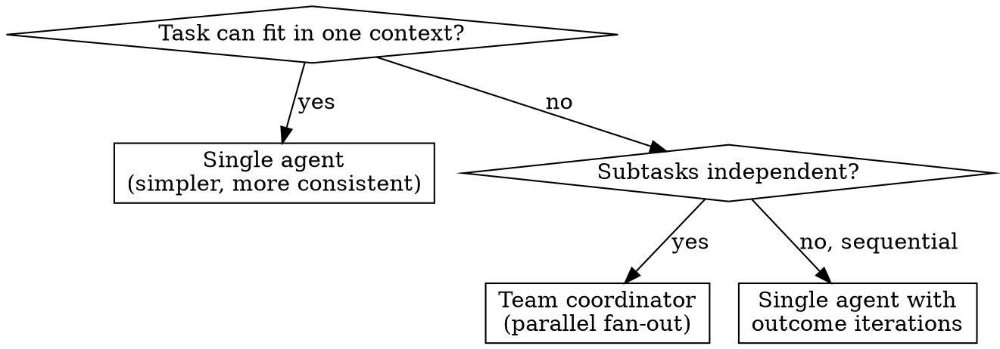

# Team Coordinator

Abstract pattern: **Task → Decompose → Parallel Specialists → Reassemble**

A coordinator agent that receives a complex task, breaks it into independent subtasks, dispatches specialist agents in parallel, and merges their results into a unified output.

## When to Use

- User says "I need a team of agents for this"
- User says "one agent for review, another for tests, another for docs"
- User says "split this work across specialists"
- User describes a task too complex for a single agent context window
- Key distinction: use team-coordinator when subtasks are INDEPENDENT and parallelizable. If tasks are sequential, use a single agent with outcome iterations.

## When NOT to Use



Per Anthropic research: a single agent with a good prompt is more consistent than a team for most tasks. Only use multi-agent when subtasks are genuinely independent and the task exceeds a single context window.

## Model Tiering

| Role | Model | Why |
|---|---|---|
| Coordinator | Opus | Decomposition + synthesis require strongest reasoning |
| Worker (code/analysis) | Sonnet | Balanced speed/quality for execution |
| Worker (search/triage) | Haiku | Fast, cheap for information gathering |

## Pre-filled Configuration

```yaml
# Coordinator agent
coordinator:
  model: claude-opus-4-6
  tools:
    - type: agent_toolset_20260401
  callable_agents: []                    # populated from worker definitions

# Worker template (repeated per specialist)
worker:
  model: claude-sonnet-4-6
  tools:
    - type: agent_toolset_20260401

# Shared environment
environment:
  networking: {type: limited, allow_mcp_servers: true, allow_package_managers: true}
  packages: {}
```

All agents share the same environment (same container and filesystem). Each runs in its own thread with isolated context.

## Questions to Ask (replaces Phase 1)

| # | Question | Why | Example answers |
|---|---|---|---|
| 1 | Name for this agent team? | Team identity | "code-review-team", "research-squad", "build-test-review" |
| 2 | Create or update existing? | Agent mode | "create new", "update coordinator agt_01abc123" |
| 3 | What is the overall task? | Coordinator's mission | "Review PRs for bugs, security, and performance" |
| 4 | How many specialists? | Team size | "3: reviewer, security-auditor, test-writer" |
| 5 | For each specialist: name + role? | Worker definitions | "reviewer: finds bugs", "security: checks OWASP top 10" |
| 6 | For each specialist: model? | Model tiering | "Sonnet for all", "Haiku for search, Sonnet for code" |
| 7 | How should results be merged? | Merge strategy | "Coordinator synthesizes", "Concatenate + dedup", "Severity-ranked" |
| 8 | MCP servers needed? | External tool access | "GitHub MCP for code access", "none" |
| 9 | MCP auth? | Vault credentials | "GitHub PAT", "none" |
| 10 | Packages/runtime? | Environment | "pip: [pytest]", "npm: [typescript]" |
| 11 | Outcome rubric? | Quality validation | Inline rubric or "no rubric" |

## Specialist Dispatch Order

```
1. mcp-vaults-expert                      — if MCP auth needed
2. agents-expert (N+1 times)              — create coordinator + each worker agent
3. environments-expert                    — one shared environment
4. sessions-expert                        — session referencing coordinator
5. events-expert                          — smoke test
```

Note: agents-expert is called N+1 times — once for the coordinator (with `callable_agents` referencing all workers) and once for each worker. Workers must be created BEFORE the coordinator so their IDs are available for `callable_agents`.

Corrected order within step 2:
```
2a. agents-expert × N     — create all worker agents first (get their IDs)
2b. agents-expert × 1     — create coordinator with callable_agents referencing worker IDs
2c. environments-expert   — parallel with 2b (independent)
```

## Coordinator System Prompt Template

```
You are a coordinator agent leading a team of specialists.

## Your Team
[For each worker:]
- [WORKER_NAME]: [ROLE_DESCRIPTION]

## Task
[OVERALL_TASK]

## Rules
1. Decompose the task into independent subtasks — one per specialist.
2. Write specific, self-contained prompts for each specialist. Include:
   - Exact files, paths, or data to work on
   - What output format you expect
   - What NOT to do (scope boundaries)
3. Never delegate understanding — do the synthesis yourself.
4. After all specialists report back, merge results:
   [MERGE_STRATEGY]
5. If a specialist fails, attempt the subtask yourself or flag it in the final output.
6. Produce a unified final output, organized by priority/severity, not by specialist.

## Anti-patterns (never do)
- "Based on your findings, fix it" — too vague, specialist will guess
- Sending the same task to all specialists — defeats parallelism
- Ignoring partial failures — always report what succeeded and what didn't
```

## Worker System Prompt Template

```
You are [WORKER_NAME], a specialist in [ROLE].

## Your task
[SPECIFIC_SUBTASK from coordinator]

## Scope
- Only work on: [SCOPE]
- Do NOT: [OUT_OF_SCOPE]

## Output format
[EXPECTED_FORMAT]

When done, return a structured summary of your findings.
```

## Agent Spec Output

```json
{
  "_team": [
    {
      "role": "worker",
      "name": "[worker_1_name]",
      "model": "claude-sonnet-4-6",
      "system": "[worker 1 system prompt]",
      "tools": [{"type": "agent_toolset_20260401"}]
    },
    {
      "role": "worker",
      "name": "[worker_2_name]",
      "model": "claude-sonnet-4-6",
      "system": "[worker 2 system prompt]",
      "tools": [{"type": "agent_toolset_20260401"}]
    },
    {
      "role": "coordinator",
      "name": "[team_name]-coordinator",
      "model": "claude-opus-4-6",
      "system": "[coordinator system prompt]",
      "tools": [{"type": "agent_toolset_20260401"}],
      "callable_agents": [
        {"type": "agent", "id": "[worker_1_id]", "version": 1},
        {"type": "agent", "id": "[worker_2_id]", "version": 1}
      ]
    }
  ],
  "mcp_servers": [],
  "environment": {
    "name": "[team_name]-env",
    "config": {
      "type": "cloud",
      "packages": {},
      "networking": {
        "type": "limited",
        "allow_mcp_servers": true,
        "allow_package_managers": true
      }
    }
  },
  "vault_ids": [],

  "_orchestration (not sent to API)": {
    "smoke_test_prompt": "Describe how you would decompose this task: [OVERALL_TASK]. List which specialist you would assign each subtask to and what you would tell them.",
    "outcome": {
      "description": "[OVERALL_TASK]",
      "rubric": {"type": "text", "content": "[RUBRIC_CONTENT]"},
      "max_iterations": 3
    },
    "creation_order": "workers first, then coordinator (needs worker IDs for callable_agents)",
    "note": "callable_agents only supports one level of delegation — workers cannot call other agents"
  }
}
```

Note: `_team` is a design-time array. Each entry is created as a separate agent via agents-expert. The coordinator references workers by ID in `callable_agents`. Only one level of delegation is supported.

## Thread Model

All agents share the container but each runs in its own **session thread** with isolated context:

- **Primary thread** = coordinator's stream (condensed view of all activity)
- **Worker threads** = each worker's reasoning and tool calls
- Session status aggregates: if any thread is `running`, session is `running`
- Thread events: `session.thread_created`, `session.thread_idle`, `agent.thread_message_sent`, `agent.thread_message_received`

Monitor via REST (CLI doesn't support threads yet):
```
GET /v1/sessions/$SESSION_ID/threads
GET /v1/sessions/$SESSION_ID/threads/$THREAD_ID/stream
GET /v1/sessions/$SESSION_ID/threads/$THREAD_ID/events
```

## Safety Defaults

- Coordinator: Opus (strongest reasoning for decomposition + synthesis)
- Workers: Sonnet default (override to Haiku for search-only workers)
- One shared environment — all agents see the same filesystem
- `callable_agents`: one level only — workers cannot call other agents
- Partial result threshold: proceed if >= 70% of workers succeed
- Coordinator always reports what failed and what succeeded
- Multi-agent is research preview — requires access request
- Smoke test validates decomposition strategy, not full execution

## Common Instantiations

| Use case | Coordinator | Workers | Merge |
|---|---|---|---|
| Code review team | Review lead | Bug finder, security auditor, perf analyzer | Severity-ranked synthesis |
| Plan-build-review | Project manager | Planner, builder, reviewer | Sequential handoff |
| Research team | Research lead | Topic A researcher, Topic B researcher | Synthesize + dedup |
| Test generation | Test lead | Unit test writer, integration test writer | Concatenate |
| Documentation team | Docs lead | API doc writer, tutorial writer, example coder | Section assembly |
