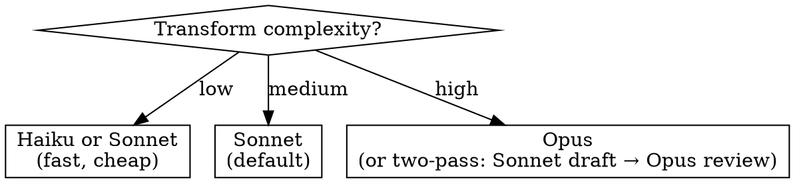

# Transformer

Abstract pattern: **Input Corpus → Systematic Modification → Output Corpus**

An agent that takes a body of content, applies a consistent transformation rule across it, and produces modified output. The rule is stated once; the agent applies it to every matching file/record.

## When to Use

- User says "migrate all X to Y across the codebase"
- User says "convert these files from format A to format B"
- User says "refactor all uses of old API to new API"
- User says "batch process these records"
- User describes any apply-rule-across-corpus workflow
- Key distinction from evaluator: transformer WRITES, evaluator only READS

## Model Selection



Default: `claude-sonnet-4-6`. Two-pass strategy (Sonnet drafts, Opus reviews failures) cuts costs 60-80%.

## Pre-filled Configuration

```yaml
model: claude-sonnet-4-6
tools:
  - type: agent_toolset_20260401          # full toolset — transformer needs read + write + bash
    configs:
      - name: web_search
        enabled: false                     # transforms work on local corpus, not web
      - name: web_fetch
        enabled: false
environment:
  networking: {type: limited, allow_package_managers: true}
  packages: {}                             # user specifies per language
```

## Questions to Ask (replaces Phase 1)

| # | Question | Why | Example answers |
|---|---|---|---|
| 1 | Name? | Agent identity | "autovalue-migrator", "csv-converter", "api-v2-upgrade" |
| 2 | Create or update existing? | Agent mode | "create new", "update agt_01abc123" |
| 3 | What is the transformation rule? | Core logic — before/after example ideal | "Migrate Java AutoValue to Records", "Convert XML configs to YAML" |
| 4 | What is the input corpus? | Shapes file handling | "GitHub repo", "uploaded CSV files", "directory of configs" |
| 5 | GitHub repo URL or file upload? | Wires resources | `https://github.com/org/repo` or "upload files" |
| 5b | Branch to check out? (default: main) | Repo checkout ref | "main", "master", "develop", "v2-migration" |
| 6 | Auth for repo/source? | Vault credential | "GitHub PAT", "none (public repo)" |
| 7 | Which files/dirs are in scope? | Scope control | "src/**/*.java", "all .xml files", "data/*.csv" |
| 8 | Protected paths (never modify)? | Safety | ".env, migrations/, CODEOWNERS" |
| 9 | Does the repo have tests? | Validation strategy | "yes — pytest", "yes — gradle test", "no tests" |
| 10 | Model complexity? | Model selection | "mechanical (Haiku)", "standard (Sonnet)", "complex (Opus)" |
| 11 | Packages/runtime needed? | Environment | "pip: [pytest]", "npm: [typescript]", "apt: [openjdk-17-jdk]" |
| 12 | Outcome rubric for validation? | Quality gate | Inline rubric text or "use test suite only" |

## Specialist Dispatch Order

```
1. files-expert                           — upload files (if not repo-based)
2. agents-expert + environments-expert    — parallel: agent definition + container with build tools
3. sessions-expert                        — session with repo/file resources mounted
4. events-expert                          — outcome-based validation with transformation rubric
```

## System Prompt Template

```
You are a transformer agent. You apply a systematic modification across a corpus.

## Transformation Rule
[RULE_DESCRIPTION]

## Before/After Example
Before: [BEFORE_EXAMPLE]
After: [AFTER_EXAMPLE]

## Scope
- In scope: [FILE_PATTERNS]
- Protected (never modify): [PROTECTED_PATHS]

## Process for each file
1. Check precondition — does this file match the transformation pattern?
2. If no match, skip silently
3. Apply the transformation
4. Run validation: [VALIDATION_COMMAND] (formatter, linter, tests)
5. If validation fails, attempt self-correction (up to 3 tries)
6. If still failing after 3 tries, revert changes and log the file for human review
7. Commit changes atomically

## Guardrails
- Never modify protected paths
- Maximum [MAX_FILES] files per run
- One commit per file or small batch (atomic commits)
- If tests regress, revert the batch immediately
- Log all skipped files and failures to a summary
```

## Agent Spec Output

```json
{
  "mode": "create",
  "name": "[user-provided]",
  "model": "claude-sonnet-4-6",
  "system": "[generated from template]",
  "tools": [
    {
      "type": "agent_toolset_20260401",
      "configs": [
        {"name": "web_search", "enabled": false},
        {"name": "web_fetch", "enabled": false}
      ]
    }
  ],
  "mcp_servers": [],
  "environment": {
    "name": "[name]-env",
    "config": {
      "type": "cloud",
      "packages": {"[manager]": ["[packages]"]},
      "networking": {
        "type": "limited",
        "allow_mcp_servers": false,
        "allow_package_managers": true
      }
    }
  },
  "resources": [
    {
      "type": "github_repository",
      "url": "[repo_url]",
      "authorization_token": "[from vault]",
      "checkout": {"type": "branch", "name": "[user-provided, default: main]"},
      "mount_path": "/workspace/repo"
    }
  ],
  "vault_ids": ["[if repo auth needed]"],

  "_orchestration (not sent to API)": {
    "smoke_test_prompt": "List the files matching [FILE_PATTERNS] and show the first file that would be transformed. Apply the rule to that one file and run validation.",
    "outcome": {
      "description": "Apply [RULE] to all matching files in [SCOPE]",
      "rubric": {"type": "text", "content": "[RUBRIC_CONTENT or test-based validation]"},
      "max_iterations": 5
    }
  }
}
```

Note: Transformers typically use `github_repository` resources mounted at session creation (not MCP). The repo is mounted directly into the container filesystem at `/workspace/repo`.

## Validation Strategy


- **L1-L2** (per file): Syntax check + linter. Fast, catches mechanical errors.
- **L3** (per batch): Run test suite. Catches semantic regressions.
- **L4** (per run): LLM judge evaluates full diff against the transformation rule. Catches scope creep.
- **L5** (final): CI pipeline on the resulting PR. Human merges.

If tests exist, they are the primary validation signal. LLM judge is additive, not a replacement.

## Safety Defaults

- `web_search`, `web_fetch`: **disabled** — transforms work on local corpus
- `networking`: `limited` with `allow_package_managers: true` (for build tools)
- Protected paths enforced in system prompt
- Atomic commits (one per file/batch)
- Auto-revert on test regression
- Max 3 self-correction attempts per file, then skip + log
- Human merges the PR — never auto-merge
- `max_iterations: 5` for outcome validation

## Common Instantiations

| Use case | Input | Rule | Validation |
|---|---|---|---|
| Code migration | Java repo | AutoValue → Records | gradle test + LLM judge |
| API upgrade | Python codebase | v1 API calls → v2 | pytest + type check |
| Format conversion | XML config files | XML → YAML | Schema validation |
| Batch data processing | CSV files | Clean + normalize rows | Row count parity + spot check |
| Dependency upgrade | package.json / pom.xml | Bump major version | Build + test suite |
| Codebase-wide rename | Any repo | old_name → new_name | Compile + grep for old_name |
