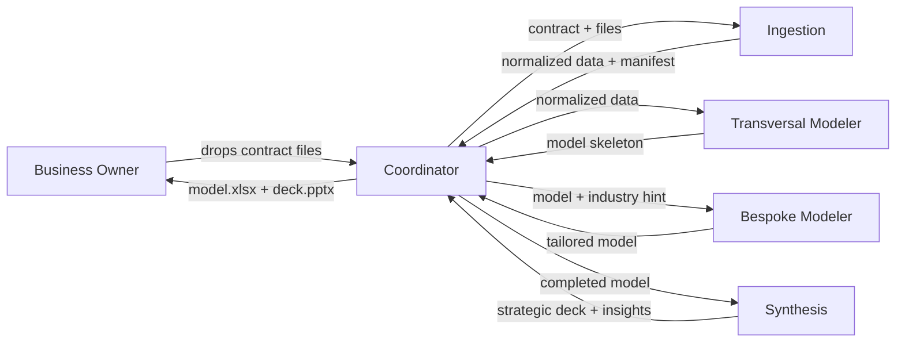

# Insignia — Standard Operating Procedure

## 1. Executive summary

This document describes how an automated five-agent team will take each of your client contracts from intake to finished strategic deck in roughly three business days — the work that currently consumes five to twelve days of your calendar. You drop the client's files in a shared location; the team classifies and cleans them, builds the standardized financial model (P&L, Balance Sheet, Cash Flow, Valuation), overlays the industry-specific layer with cited benchmarks, and synthesizes a seven-slide strategic deck with three to five number-backed insights. You review before anything goes to your client. You remain the final gate.

The capacity shift is material. Today, at a lead time of five to twelve days per contract and roughly twenty contracts a year, the process consumes between one hundred and two hundred forty of your working days — leaving at most twenty days a year for strategic growth. Compressing lead time to three days makes sixty or more contracts a year achievable, clearing the client queue you've already turned away work from and moving the business from capacity-constrained to demand-driven.

Five specialists sit behind this. The **project manager** routes one contract through the sequence and assembles the final deliverables. The **intake clerk** classifies and normalizes the heterogeneous PDFs, Excel workbooks, CSVs, and Word documents you receive. The **standard modeler** builds the transversal financial core that's identical across every client. The **industry specialist** tailors the model to the client's sector, fills benchmark assumptions, and cites every number. The **strategist** distills the finished model into the three to five things your client's board actually needs to discuss.

See §2 — How the team works together — for the end-to-end flow. The rest of this document walks through what runs where, how it's secured, how it handles uncertainty, what you can verify, and what it costs.

The point of this SOP in one sentence: it moves you from Janitorial AI — using tools to fix typos — to Architectural AI — using tools to drive insights.

## 2. How the team works together

One contract per run. The project manager is the only agent you interact with — you hand it the contract, it hands you the deliverables. Between those two moments, it routes the work through four specialists in strict sequence: intake clerk first, then standard modeler, then industry specialist, then strategist. Each specialist returns a structured report to the project manager; none of them talk to each other directly. This matters because every handoff is inspectable: if the intake clerk flags missing data, the pipeline halts there rather than passing bad inputs downstream.

The sequence is deliberately linear. The standard modeler needs the intake clerk's normalized data before it can build the skeleton. The industry specialist needs the skeleton before it can overlay sector-specific line items. The strategist needs the completed model before it can pick insights. Parallelizing these would not save time on a single contract, and it would weaken the quality gates between stages.

In v1 the pipeline processes one contract at a time. If two contracts arrive together, the second waits until the first finishes — a three-day delay, not a nine-day one. Multi-contract batch mode is on the v2 roadmap (see §13).

## 3. Where it runs

The pipeline runs on Anthropic's managed cloud infrastructure. Each contract spins up its own isolated container — a fresh, sealed execution environment with no memory of prior runs and no shared filesystem with any other contract. When the run ends, the container is destroyed. Nothing persists on our side between contracts, and nothing persists on Anthropic's side either. The next run starts from zero.

This statelessness is deliberate, and it's a feature. There is no cross-contamination between clients: yesterday's numbers cannot bleed into today's model, and a mistake on one contract cannot silently propagate to another. It also means no standing copy of your clients' data exists outside the active run window. When the container is destroyed, so is every intermediate and output file it produced.

Two practical consequences follow from this design. First, the pipeline is not a chat assistant — it does not remember past conversations or past clients. Every contract starts fresh. Cross-contract memory (so the pipeline can leverage a lesson learned on a prior microfinance client when working a new one) is on the v2 roadmap, but in v1 every contract is its own sealed engagement. Second, the tools, templates, and playbooks the specialists rely on are loaded fresh into each container at run start — they are not baked into long-lived servers. If a template changes, the next run picks up the new one automatically.

You will never need to log into, monitor, or maintain the runtime infrastructure. You drop files and receive deliverables; everything between is managed.

## 4. Security & confidentiality

Five things determine the pipeline's security posture. They are worth reading in full before signing.

**Credentials stay on your side.** In v1 the pipeline never touches your Microsoft, email, or banking credentials. The only input mechanism is a shared folder you populate manually with the contract's files. In v2, when the pipeline reads directly from your Teams and OneDrive, credential exchange runs through Microsoft's enterprise OAuth vault — we never hold or see your passwords, tokens, or refresh secrets at any point.

**Files live only inside the active run.** Input files are mounted read-only into the isolated container — the specialists cannot modify what you uploaded. Intermediate and output files are written to a session-scoped working directory that exists only for the duration of the run. When the container is destroyed at the end of the run, every copy of every file goes with it. There is no long-lived bucket, no backup, no archive on our side.

**No silent outbound traffic.** Three of the five specialists — the project manager, intake clerk, and standard modeler — have no access to the internet at all. They physically cannot reach outside the container. Two specialists do reach the internet: the industry specialist searches for sector benchmarks when no local playbook applies, and the strategist occasionally looks up public market context for framing insights. Every outbound search is logged, and every figure that enters the model or the deck from a web source carries its source URL in the assumption notes. Nothing about your clients — no names, no financial figures, no file contents — is ever transmitted outward as part of these searches. The specialists search *for* information; they do not share yours.

**Data residency is US-based.** The underlying infrastructure is Anthropic's United States cloud. Before deploying the pipeline on a client whose regulator (or whose own internal policy) requires in-country data processing — common in some regulated LatAm financial sectors — confirm with them that US processing is acceptable. This is the single residency question worth surfacing at signing rather than discovering mid-engagement.

**Every action is auditable.** No step of the pipeline operates in secret. The intake clerk's classification log, the industry specialist's assumption sources, the strategist's cell references — all are named files you can open after the run. Section 8 covers the audit trail in detail.

## 5. Determinism & reproducibility

AI-powered pipelines are not mathematically deterministic the way an Excel formula is. Two runs on the same input can produce slightly different outputs, because the underlying models choose their words and their next steps probabilistically. This is worth stating plainly because it sounds alarming on first read — and then explaining why it is, in fact, carefully engineered.

We engineer each specialist to be as reproducible as its job allows. Some steps are nearly deterministic by design; others exercise judgment because judgment is the point. The table below makes the spectrum explicit.

| Agent | Determinism | What this means for you |
|-------|-------------|-------------------------|
| Intake clerk | Near-deterministic | Same input file → same normalized data |
| Standard modeler | Deterministic math, judgment on assumption fill-ins | Same inputs → same skeleton; any default it filled is flagged with a visible marker |
| Industry specialist | Judgment within guardrails | Two runs may pick different but equally valid sources; both are cited |
| Strategist | Judgment (this is the point) | The three to five insights may differ across runs; all are number-backed to specific model cells |

The strategist is the agent most often misunderstood here. It *should not* be fully deterministic. Strategic framing is the value — if the strategist said exactly the same thing on every run, it would be a template, not an advisor. What *is* deterministic is the grounding: every insight the strategist surfaces is tied to a specific cell in the model, a specific number, and a specific "so what." Nothing is ever unfalsifiable. You can disagree with the framing, but you can always trace the number.

The industry specialist sits one notch down. When two valid sources for a sector benchmark disagree — for example, one industry report says microfinance WACC is 14%, another says 16% — the specialist may land on either number on different runs, and it will cite whichever source it used. The guardrail is that it will not invent a number and it will not pick unsourced midpoints; if sources disagree substantially, it states the range and picks the midpoint with rationale.

The standard modeler and the intake clerk are near-deterministic. Given the same file, the intake clerk will classify it the same way and produce the same normalized output. Given the same normalized inputs, the standard modeler will produce the same skeleton. Any default it has to fill in because data was missing — for example, cost of debt when the client's filings don't report it — is surfaced with a visible marker in the `Assumptions` sheet so the industry specialist (and you) can override it.

In short: the pipeline is reproducible where reproducibility matters, and it is judgment-based where judgment is the deliverable.

## 6. Quality controls

Four mechanisms catch errors before a deliverable leaves the pipeline. None of them rely on you spotting the problem yourself.

**Self-validating workbook cells.** Every financial sheet — P&L, Balance Sheet, Cash Flow — embeds a validation cell that returns either `OK` or `UNBALANCED` with the exact delta. The Balance Sheet checks that assets equal liabilities plus equity. The Cash Flow statement ties its ending cash back to the Balance Sheet's cash line. If any check fails by more than one cent of the reporting unit, the run returns a `failed` status rather than handing you a model that looks complete but is quietly broken.

**Missing-field halts.** If the intake clerk detects that a required field is absent — 2023 P&L data missing when 2024 is reported, a scanned-only PDF with no extractable text, a balance sheet that cannot be parsed — it does not guess. It emits a `blocked` envelope back to the project manager, which passes it to you with the specific missing items named. The pipeline refuses to model on incomplete data. You then decide whether to chase the client, escalate, or proceed despite the gap. The cost of this design is that some runs stop early; the value is that no bad model ever silently ships.

**Source-cited assumptions.** Every numeric assumption the industry specialist injects — sector gross margin, WACC, terminal growth rate, comparable multiple — is logged in the `assumption_notes.md` artifact with its source. The source is either a path to a local industry playbook or a public URL retrieved by web search at run time. If the specialist cannot find a source, it flags the assumption explicitly rather than inventing a number. You can audit the entire assumption layer in one file.

**Formula-only computed cells.** Every subtotal, total, ratio, and derived number in the workbook is a live Excel formula, never a hard-coded value. Gross Profit is `Revenue − COGS` as a formula, not the answer pre-computed by the specialist and typed in. This matters for two reasons: first, you can audit any computed cell by clicking on it and reading the formula; second, if you or the client update a historical figure after delivery, every dependent cell updates correctly.

## 7. Human oversight

Three explicit moments put you in the loop. Between them, the pipeline runs unattended — which is the point of automation. These three moments are deliberate gates, not incidental pauses.

**You drop files.** Nothing starts until you place the contract's input files in the shared folder. There is no auto-intake in v1, and there is no scheduler that starts runs on a clock. This is a choice: you control what enters the pipeline and when. Automatic Teams/OneDrive intake is on the v2 roadmap.

**You receive a "blocked" envelope when the data is incomplete.** If the intake clerk flags missing required fields — scanned-only PDFs, absent periods, unbalanced source data — the pipeline halts and the project manager returns a structured envelope naming the specific gaps. You then decide: chase the client for the missing piece, escalate internally, or (rarely) accept the gap and ask the pipeline to proceed with explicit caveats. The pipeline will not silently substitute defaults for missing financial data. This is the strongest single guardrail against shipping a bad deliverable — the pipeline stops the moment it doubts its inputs, and you adjudicate.

**You review before hand-off.** Nothing is ever sent directly to your client. When the run finishes, the project manager returns two files to you: the completed workbook and the strategic deck. You open them, you read them, you decide whether to forward. The pipeline has no outbound channel to your clients.

You are the final gate. The pipeline is a team of specialists working for you — it does not work around you.

## 8. Audit trail

Every run leaves a complete paper trail. If anyone — your partner, your client, your client's board, a regulator — ever asks "where did this number come from?", there is a named file that answers. Nothing is implicit.

The artifacts you can open after any run:

- **`manifest.json`** — the intake clerk's interpretation of each input file: what type it thought each file was (financial statement, identifier doc, risk classification, market research), the confidence of that classification, and any quality flags it raised during extraction.
- **`classification.json`** — the per-file log of which files were read by which tool (the PDF reader, the Excel reader, direct CSV parsing) and whether any fell back to secondary extraction methods.
- **`assumption_notes.md`** — every assumption the industry specialist injected into the model, with its source. A local playbook section, a public URL, or an explicit flag that no source was available. One file tells you every non-obvious number in the bespoke layer and why it is there.
- **Validation cells inside the workbook** — each financial sheet has a named cell reporting `OK` or `UNBALANCED` with the delta. You can see at a glance whether the model passed its own internal checks.
- **`coordinator.log`** — the run's timeline: when each specialist was dispatched, what inputs it received, what status it returned. Useful for post-mortem if a run produced unexpected output.

These are not artifacts you must read on every run. They exist so that when a question arises — three months after delivery, during a board discussion, during your client's own audit — you can answer it with a file, not a guess.

## 9. Running cost estimate

_To be drafted in Task 13._

## 10. v1 limits

_To be drafted in Task 14._

# Part II — The agents

## Coordinator — the project manager

_To be drafted in Task 15._

## Ingestion — the intake clerk

_To be drafted in Task 16._

## Transversal modeler — the standard modeler

_To be drafted in Task 17._

## Bespoke modeler — the industry specialist

_To be drafted in Task 18._

## Synthesis — the strategist

_To be drafted in Task 19._

# Part III — Working together

## 11. Your workflow as the Business Owner

_To be drafted in Task 20._

## 12. What we need from you

_To be drafted in Task 21._

## 13. v2 roadmap

_To be drafted in Task 22._

# Appendix — Technical reference

## A1. Agents

_To be drafted in Task 23._

## A2. File paths and environment

_To be drafted in Task 23._

## A3. Further reading

_To be drafted in Task 23._
