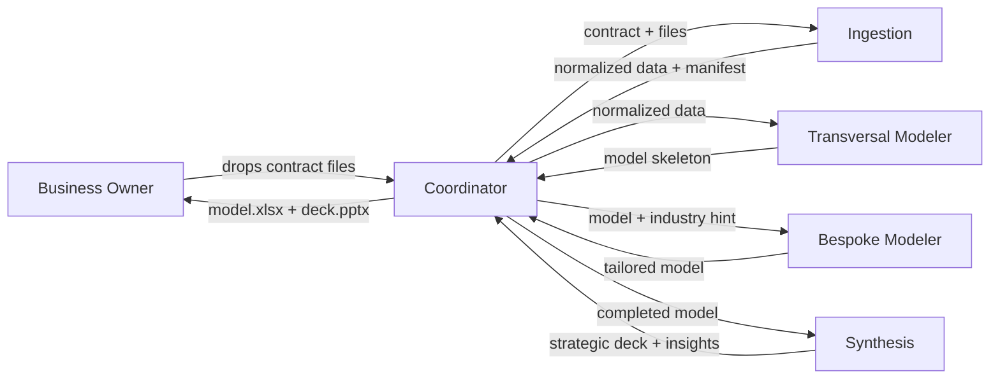

# Insignia — Standard Operating Procedure

## 1. Executive summary

This document describes how an automated five-agent team will take each of your client contracts from intake to finished strategic deck in roughly three business days — the work that currently consumes five to twelve days of your calendar. You drop the client's files in a shared location; the team classifies and cleans them, builds the standardized financial model (P&L, Balance Sheet, Cash Flow, Valuation), overlays the industry-specific layer with cited benchmarks, and synthesizes a seven-slide strategic deck with three to five number-backed insights. You review before anything goes to your client. You remain the final gate.

The capacity shift is material. Today, at a lead time of five to twelve days per contract and roughly twenty contracts a year, the process consumes between one hundred and two hundred forty of your working days — leaving at most twenty days a year for strategic growth. Compressing lead time to three days makes sixty or more contracts a year achievable, clearing the client queue you've already turned away work from and moving the business from capacity-constrained to demand-driven.

Five specialists sit behind this. The **project manager** routes one contract through the sequence and assembles the final deliverables. The **intake clerk** classifies and normalizes the heterogeneous PDFs, Excel workbooks, CSVs, and Word documents you receive. The **standard modeler** builds the transversal financial core that's identical across every client. The **industry specialist** tailors the model to the client's sector, fills benchmark assumptions, and cites every number. The **strategist** distills the finished model into the three to five things your client's board actually needs to discuss.

See §2 — How the team works together — for the end-to-end flow. The rest of this document walks through what runs where, how it's secured, how it handles uncertainty, what you can verify, and what it costs.

The point of this SOP in one sentence: it moves you from Janitorial AI — using tools to fix typos — to Architectural AI — using tools to drive insights.

## 2. How the team works together

One contract per run. The project manager is the only agent you interact with — you hand it the contract, it hands you the deliverables. Between those two moments, it routes the work through four specialists in strict sequence: intake clerk first, then standard modeler, then industry specialist, then strategist. Each specialist returns a structured report to the project manager; none of them talk to each other directly. This matters because every handoff is inspectable: if the intake clerk flags missing data, the pipeline halts there rather than passing bad inputs downstream.

The sequence is deliberately linear. The standard modeler needs the intake clerk's normalized data before it can build the skeleton. The industry specialist needs the skeleton before it can overlay sector-specific line items. The strategist needs the completed model before it can pick insights. Parallelizing these would not save time on a single contract, and it would weaken the quality gates between stages.

In v1 the pipeline processes one contract at a time. If two contracts arrive together, the second waits until the first finishes — a three-day delay, not a nine-day one. Multi-contract batch mode is on the v2 roadmap (see §13).

## 3. Where it runs

The pipeline runs on Anthropic's managed cloud infrastructure. Each contract spins up its own isolated container — a fresh, sealed execution environment with no memory of prior runs and no shared filesystem with any other contract. When the run ends, the container is destroyed. Nothing persists on our side between contracts, and nothing persists on Anthropic's side either. The next run starts from zero.

This statelessness is deliberate, and it's a feature. There is no cross-contamination between clients: yesterday's numbers cannot bleed into today's model, and a mistake on one contract cannot silently propagate to another. It also means no standing copy of your clients' data exists outside the active run window. When the container is destroyed, so is every intermediate and output file it produced.

Two practical consequences follow from this design. First, the pipeline is not a chat assistant — it does not remember past conversations or past clients. Every contract starts fresh. Cross-contract memory (so the pipeline can leverage a lesson learned on a prior microfinance client when working a new one) is on the v2 roadmap, but in v1 every contract is its own sealed engagement. Second, the tools, templates, and playbooks the specialists rely on are loaded fresh into each container at run start — they are not baked into long-lived servers. If a template changes, the next run picks up the new one automatically.

You will never need to log into, monitor, or maintain the runtime infrastructure. You drop files and receive deliverables; everything between is managed.

## 4. Security & confidentiality

Five things determine the pipeline's security posture. They are worth reading in full before signing.

**Credentials stay on your side.** In v1 the pipeline never touches your Microsoft, email, or banking credentials. The only input mechanism is a shared folder you populate manually with the contract's files. In v2, when the pipeline reads directly from your Teams and OneDrive, credential exchange runs through Microsoft's enterprise OAuth vault — we never hold or see your passwords, tokens, or refresh secrets at any point.

**Files live only inside the active run.** Input files are mounted read-only into the isolated container — the specialists cannot modify what you uploaded. Intermediate and output files are written to a session-scoped working directory that exists only for the duration of the run. When the container is destroyed at the end of the run, every copy of every file goes with it. There is no long-lived bucket, no backup, no archive on our side.

**No silent outbound traffic.** Three of the five specialists — the project manager, intake clerk, and standard modeler — have no access to the internet at all. They physically cannot reach outside the container. Two specialists do reach the internet: the industry specialist searches for sector benchmarks when no local playbook applies, and the strategist occasionally looks up public market context for framing insights. Every outbound search is logged, and every figure that enters the model or the deck from a web source carries its source URL in the assumption notes. Nothing about your clients — no names, no financial figures, no file contents — is ever transmitted outward as part of these searches. The specialists search *for* information; they do not share yours.

**Data residency is US-based.** The underlying infrastructure is Anthropic's United States cloud. Before deploying the pipeline on a client whose regulator (or whose own internal policy) requires in-country data processing — common in some regulated LatAm financial sectors — confirm with them that US processing is acceptable. This is the single residency question worth surfacing at signing rather than discovering mid-engagement.

**Every action is auditable.** No step of the pipeline operates in secret. The intake clerk's classification log, the industry specialist's assumption sources, the strategist's cell references — all are named files you can open after the run. Section 8 covers the audit trail in detail.

## 5. Determinism & reproducibility

AI-powered pipelines are not mathematically deterministic the way an Excel formula is. Two runs on the same input can produce slightly different outputs, because the underlying models choose their words and their next steps probabilistically. This is worth stating plainly because it sounds alarming on first read — and then explaining why it is, in fact, carefully engineered.

We engineer each specialist to be as reproducible as its job allows. Some steps are nearly deterministic by design; others exercise judgment because judgment is the point. The table below makes the spectrum explicit.

| Agent | Determinism | What this means for you |
|-------|-------------|-------------------------|
| Intake clerk | Near-deterministic | Same input file → same normalized data |
| Standard modeler | Deterministic math, judgment on assumption fill-ins | Same inputs → same skeleton; any default it filled is flagged with a visible marker |
| Industry specialist | Judgment within guardrails | Two runs may pick different but equally valid sources; both are cited |
| Strategist | Judgment (this is the point) | The three to five insights may differ across runs; all are number-backed to specific model cells |

The strategist is the agent most often misunderstood here. It *should not* be fully deterministic. Strategic framing is the value — if the strategist said exactly the same thing on every run, it would be a template, not an advisor. What *is* deterministic is the grounding: every insight the strategist surfaces is tied to a specific cell in the model, a specific number, and a specific "so what." Nothing is ever unfalsifiable. You can disagree with the framing, but you can always trace the number.

The industry specialist sits one notch down. When two valid sources for a sector benchmark disagree — for example, one industry report says microfinance WACC is 14%, another says 16% — the specialist may land on either number on different runs, and it will cite whichever source it used. The guardrail is that it will not invent a number and it will not pick unsourced midpoints; if sources disagree substantially, it states the range and picks the midpoint with rationale.

The standard modeler and the intake clerk are near-deterministic. Given the same file, the intake clerk will classify it the same way and produce the same normalized output. Given the same normalized inputs, the standard modeler will produce the same skeleton. Any default it has to fill in because data was missing — for example, cost of debt when the client's filings don't report it — is surfaced with a visible marker in the `Assumptions` sheet so the industry specialist (and you) can override it.

In short: the pipeline is reproducible where reproducibility matters, and it is judgment-based where judgment is the deliverable.

## 6. Quality controls

Four mechanisms catch errors before a deliverable leaves the pipeline. None of them rely on you spotting the problem yourself.

**Self-validating workbook cells.** Every financial sheet — P&L, Balance Sheet, Cash Flow — embeds a validation cell that returns either `OK` or `UNBALANCED` with the exact delta. The Balance Sheet checks that assets equal liabilities plus equity. The Cash Flow statement ties its ending cash back to the Balance Sheet's cash line. If any check fails by more than one cent of the reporting unit, the run returns a `failed` status rather than handing you a model that looks complete but is quietly broken.

**Missing-field halts.** If the intake clerk detects that a required field is absent — 2023 P&L data missing when 2024 is reported, a scanned-only PDF with no extractable text, a balance sheet that cannot be parsed — it does not guess. It emits a `blocked` envelope back to the project manager, which passes it to you with the specific missing items named. The pipeline refuses to model on incomplete data. You then decide whether to chase the client, escalate, or proceed despite the gap. The cost of this design is that some runs stop early; the value is that no bad model ever silently ships.

**Source-cited assumptions.** Every numeric assumption the industry specialist injects — sector gross margin, WACC, terminal growth rate, comparable multiple — is logged in the `assumption_notes.md` artifact with its source. The source is either a path to a local industry playbook or a public URL retrieved by web search at run time. If the specialist cannot find a source, it flags the assumption explicitly rather than inventing a number. You can audit the entire assumption layer in one file.

**Formula-only computed cells.** Every subtotal, total, ratio, and derived number in the workbook is a live Excel formula, never a hard-coded value. Gross Profit is `Revenue − COGS` as a formula, not the answer pre-computed by the specialist and typed in. This matters for two reasons: first, you can audit any computed cell by clicking on it and reading the formula; second, if you or the client update a historical figure after delivery, every dependent cell updates correctly.

## 7. Human oversight

Three explicit moments put you in the loop. Between them, the pipeline runs unattended — which is the point of automation. These three moments are deliberate gates, not incidental pauses.

**You drop files.** Nothing starts until you place the contract's input files in the shared folder. There is no auto-intake in v1, and there is no scheduler that starts runs on a clock. This is a choice: you control what enters the pipeline and when. Automatic Teams/OneDrive intake is on the v2 roadmap.

**You receive a "blocked" envelope when the data is incomplete.** If the intake clerk flags missing required fields — scanned-only PDFs, absent periods, unbalanced source data — the pipeline halts and the project manager returns a structured envelope naming the specific gaps. You then decide: chase the client for the missing piece, escalate internally, or (rarely) accept the gap and ask the pipeline to proceed with explicit caveats. The pipeline will not silently substitute defaults for missing financial data. This is the strongest single guardrail against shipping a bad deliverable — the pipeline stops the moment it doubts its inputs, and you adjudicate.

**You review before hand-off.** Nothing is ever sent directly to your client. When the run finishes, the project manager returns two files to you: the completed workbook and the strategic deck. You open them, you read them, you decide whether to forward. The pipeline has no outbound channel to your clients.

You are the final gate. The pipeline is a team of specialists working for you — it does not work around you.

## 8. Audit trail

Every run leaves a complete paper trail. If anyone — your partner, your client, your client's board, a regulator — ever asks "where did this number come from?", there is a named file that answers. Nothing is implicit.

The artifacts you can open after any run:

- **`manifest.json`** — the intake clerk's interpretation of each input file: what type it thought each file was (financial statement, identifier doc, risk classification, market research), the confidence of that classification, and any quality flags it raised during extraction.
- **`classification.json`** — the per-file log of which files were read by which tool (the PDF reader, the Excel reader, direct CSV parsing) and whether any fell back to secondary extraction methods.
- **`assumption_notes.md`** — every assumption the industry specialist injected into the model, with its source. A local playbook section, a public URL, or an explicit flag that no source was available. One file tells you every non-obvious number in the bespoke layer and why it is there.
- **Validation cells inside the workbook** — each financial sheet has a named cell reporting `OK` or `UNBALANCED` with the delta. You can see at a glance whether the model passed its own internal checks.
- **`coordinator.log`** — the run's timeline: when each specialist was dispatched, what inputs it received, what status it returned. Useful for post-mortem if a run produced unexpected output.

These are not artifacts you must read on every run. They exist so that when a question arises — three months after delivery, during a board discussion, during your client's own audit — you can answer it with a file, not a guess.

## 9. Running cost estimate

This section estimates what running the pipeline against Anthropic's infrastructure will cost you per contract and per year. It is *not* our fee — it is the pass-through cost of the underlying service.

The pipeline bills on three dimensions: tokens consumed by the five specialists, session runtime (metered only while a run is actively computing), and a small fee per web search (used by the industry specialist). Anthropic publishes all three rates; they are quoted below.

### Per-contract breakdown (estimated, based on the Tafi contract)

| Line item | Estimated cost |
|---|---:|
| Token usage — five agents combined (~918K input + 54K output across 142 turns) | $5.67 |
| Session runtime (~3 active hours at $0.08/hour) | $0.24 |
| Web search (~10 industry-benchmark queries at $10 per thousand) | $0.10 |
| **Total per contract** | **~$6.00** |

The expensive component is token usage, and within that the three modeling agents (standard modeler, industry specialist, strategist) account for roughly ninety-three percent of the token bill because they run on Opus — Anthropic's most capable model — and they run for the most turns. The intake clerk and project manager run on Sonnet and are collectively under fifty cents per contract.

### Annual projection

Using $6 per contract as the unit cost, annual API spend scales linearly with throughput:

| Annual contracts | Scenario | Annual API cost |
|---:|---|---:|
| 25 | Current baseline | ~$150 |
| 35 | Cleared queue, near-term | ~$210 |
| 50 | Doubled capacity | ~$300 |
| 75 | Full 3× target | ~$450 |

For context: at current manual workflow rates, the pipeline replaces between one hundred and two hundred forty business days per year of the Business Owner's time (see the diagnostic for the labor breakdown). The API cost at any realistic throughput is a small fraction of the labor it substitutes for.

### Methodology and honest caveats

What was measured directly:
- Anthropic's published rates, pulled on 2026-04-16 from the pricing page and platform documentation: Opus input $5 / output $25 per million tokens, Sonnet input $3 / output $15 per million tokens, session runtime $0.08 per active hour, web search $10 per thousand queries.
- The five agents' system prompt sizes (5,655 tokens combined), the Tafi PDF full-text extraction size (15,961 tokens), and the Tafi portfolio CSV summary size (2,718 tokens). Measured via Anthropic's `count_tokens` endpoint and local extraction runs.

What remains estimated:
- Turn counts per agent (~10 to ~45 depending on complexity).
- Accumulated history growth across a long run.
- Average output tokens per turn.
- Size of a web search result bundle.

The pre-measurement estimate had a ±30–50% uncertainty band. After measurement the band tightens to roughly ±15–25%. The remaining uncertainty is resolved only by a live run — which is why the first real Tafi contract should be instrumented to capture actuals and replace these projections.

### Optimization already on deck

Anthropic's prompt-caching feature, when enabled, reduces cache-read input tokens to $0.50 per million on Opus and $0.30 per million on Sonnet — a tenth of the standard rate. Because the five system prompts are static across every run, caching them is essentially free engineering work and should reduce per-contract cost by roughly ten to fifteen percent. It will be enabled before the first production run.

### Disclaimer

Claude Managed Agents is generally available but the rates above were pulled at a point in time and may change. Volume discounts above certain thresholds are available through enterprise sales; the projection above assumes list rates. Nothing in this section is a quote — it is a planning estimate meant to give you order of magnitude. The first live contract will produce measured numbers that replace it.

## 10. v1 limits

This is the honest list of what the pipeline does *not* do yet. Framing matters: each of these is a deliberate v1 boundary, and each has a specific v2 successor that closes the gap. Section 13 describes the v2 roadmap in full.

**File intake is manual.** Today you drop the contract's files into a shared folder; the pipeline picks them up from there. There is no automatic pull from Teams, OneDrive, or email. This preserves the current human step where you decide what goes in — which also means the four-day manual classification window from the diagnostic is not eliminated yet, only reduced to however long it takes you to drop the files. *v2 adds*: direct, credential-safe reads from your Teams channels and OneDrive folders.

**PowerBI dashboards are not yet refreshed automatically.** The strategist produces the deck and the model; it does not yet push key metrics into a live partner-facing dashboard. Recurring Power BI views remain a manual export step. *v2 adds*: authenticated PowerBI dataset refresh from the strategist's output.

**Each contract starts from zero.** The pipeline has no memory across contracts. If the industry specialist researches microfinance sector benchmarks on Contract A, those exact findings are not automatically reused on Contract B in the same sector — the search runs again. Every run is an isolated engagement. *v2 adds*: a cross-contract memory store that caches sector findings, client-context notes, and prior-run lessons, keyed by industry and invalidated when stale.

**One contract at a time.** If two contracts arrive simultaneously, the second waits for the first to finish. A single run takes approximately three hours of compute; two serial runs take six. *v2 adds*: multi-contract batch mode with session-level parallelism.

**Quality gate is your review, not an automatic rubric.** The pipeline's internal quality controls (balance checks, source-cited assumptions, formula-only cells) catch mechanical errors, but they do not grade the deliverable against a strategic-quality rubric. Insights are number-backed but not automatically scored for board-worthiness. *v2 adds*: a rubric-graded self-check on model quality and deck quality before hand-off.

**Industry playbooks are minimal.** v1 ships a single generic fallback playbook. When a sector has no dedicated playbook (microfinance, for instance), the industry specialist falls back to public web sources — slower, sometimes less precise, and more expensive per contract due to the search volume. *v2 adds*: a curated library of per-sector playbooks (financial services, logistics, retail, SaaS, agribusiness, infrastructure) that eliminate most web-search rounds and speed up the bespoke layer.

None of these gaps block the pipeline from delivering full value on v1. They are the known edges of what the first version can do, stated plainly so you can plan around them.

# Part II — The agents

## Coordinator — the project manager

The coordinator is the only agent you interact with directly. Think of it as the project manager of a four-person engagement team: it receives the brief from you, assigns each part of the work to the right specialist, collects their reports, checks that nothing is missing, and hands you the finished deliverables. It does not do modeling work itself — it routes it.

### What it reads and what it delivers

**Reads:** the contract ID, the list of input files you dropped, and the client name.

**Delivers to you:** a single envelope containing the completed financial model (`model.xlsx`), the strategic deck (`deck.pptx`), a list of key insights, and a status — `delivered`, `blocked_on_client`, or `failed`. Plus a timeline log of what happened during the run.

### How it thinks

The coordinator follows a strict sequence: intake first, then standard modeling, then bespoke overlay, then synthesis. Each specialist returns a structured report; the coordinator inspects the status field and decides whether to continue. If the intake clerk flags missing data, the coordinator halts and returns `blocked_on_client` with the specific gaps named — it does not try to substitute defaults or call the next specialist on a bad foundation. If any other specialist fails mid-run, the coordinator short-circuits the sequence and reports `failed` with the upstream error. It never invents outputs to mask a partial run.

### What's under the hood

- **Model:** Sonnet. The coordinator is a router, not a modeler — it needs judgment for orchestration, not deep analytical power. Sonnet is the right cost-performance tradeoff here.
- **Tools:** read and write only. It has no bash shell, no internet access, no ability to open or modify Excel files. Its only job is routing, and its tools are scoped accordingly.
- **Skills:** none. Skills are specialized capabilities (PDF reading, Excel editing, slide generation) reserved for the agents that need them.

### Determinism

Highly deterministic. Given the same inputs and the same specialist outputs, the coordinator will route in the same order, apply the same halt conditions, and produce the same final envelope. It is the most predictable agent in the pipeline.

### Security posture

The coordinator has no outbound internet access. It reads the inputs you provided, writes the final envelope, and writes a status log to the session output directory. Nothing it does touches anything outside the active run container.

### Failure modes

- **Intake blocked:** the intake clerk returns a `blocked` status with missing fields. The coordinator passes this straight through to you as `blocked_on_client`. You decide what to do next.
- **Worker failure:** any specialist returns `failed`. The coordinator short-circuits, surfaces the error, and reports `failed` — no silent retry, no fallback to defaults.
- **Malformed worker report:** extremely rare, but if a specialist returns a report the coordinator cannot parse, the run fails cleanly rather than proceeding on a misinterpreted envelope.

### What you can verify after a run

- `coordinator.log` — the timeline of specialist dispatches and returned statuses
- The final envelope — a single JSON-like report summarizing the run's outcome, with paths to every deliverable

## Ingestion — the intake clerk

The intake clerk is the first specialist to see the contract's files. Its job is the work you currently spend four days on: taking whatever the client sent — PDF financial statements, Excel workbooks, CSV portfolios, the occasional Word narrative — and turning it into a clean, model-ready dataset. It classifies each file, extracts the structured data, normalizes it into canonical form, and flags anything missing or suspicious.

### What it reads and what it delivers

**Reads:** every file you drop for the contract, in whatever format the client sent it.

**Delivers:** a normalized dataset organized into three canonical CSVs (P&L, Balance Sheet, Cash Flow), an entity metadata file, a narrative-assumptions file, and a manifest that catalogs every input, every extraction, and every quality flag. The manifest is what downstream agents read; the underlying raw files are never touched again.

### How it thinks

For each file it tries to determine: *what is this?* (financial statement, identifier document, risk classification, market research, something else), *how confident am I?*, and *can I extract the structured content reliably?* For PDFs it prefers a direct text extraction; if the PDF is scanned or image-only, it falls back to a more aggressive extraction method and flags the situation. For Excel workbooks it reads every sheet. For CSVs it reads directly. For anything it cannot confidently classify or extract, it flags the file rather than guessing.

The crucial discipline is that the intake clerk never invents data. If a required field is missing — a reporting period, a balance-sheet side, a line item — it says so and halts the pipeline rather than fabricating defaults. This is how the diagnostic's "broken files, manual outreach" pain point is eliminated: you still do the outreach when needed, but only when the pipeline has identified a specific, named gap.

### What's under the hood

- **Model:** Sonnet. Classification and normalization need judgment but not deep analytical reasoning; Sonnet is fast and cost-effective for this workload.
- **Tools:** bash, read, write, edit. Bash lets it invoke specialized libraries when the standard skills are not enough (for example, to run an OCR fallback on a scanned PDF).
- **Skills:** PDF reader, Excel reader, Word reader. Three specialized capabilities, one per common file format.

### Determinism

Near-deterministic. Given the same input files, the intake clerk classifies them the same way, extracts the same text, and produces the same normalized CSVs. The only source of variation is the small-scale judgment on ambiguous files — which is always surfaced in the manifest's confidence scores, never hidden.

### Security posture

No outbound internet access. The intake clerk reads what you mounted into the run container and writes the normalized output to the same container's session directory. Nothing leaves.

### Failure modes

- **Missing required fields** — returns a `blocked` status with the specific gaps named. The coordinator surfaces this to you as `blocked_on_client`.
- **Scanned or image-only PDF** — tries a direct extraction, detects that almost no text came out (less than fifty characters per page on average), and falls back to a layout-aware extraction. If that still yields nothing, it flags the file as unreadable and halts.
- **Unbalanced or inconsistent source data** — raises a quality flag in the manifest with severity; the coordinator decides whether to proceed or halt based on severity.
- **Ambiguous file type** — classifies with low confidence and flags it; does not proceed on files it could not confidently categorize.

### What you can verify after a run

- `manifest.json` — the full catalog: files read, types assigned, confidence scores, quality flags, missing fields.
- `classification.json` — the per-file log of which extraction method succeeded and any fallbacks that fired.
- The `normalized/` directory — three CSVs and an entity file you can open in Excel to verify the pipeline saw the client's numbers correctly.

## Transversal modeler — the standard modeler

The standard modeler builds the financial core that is identical across every client you serve: Income Statement, Balance Sheet, Cash Flow, and Valuation. This is the work the diagnostic identifies as the transversal layer — the same structure applied contract after contract, differing only in the numbers that plug into it. Automating this layer is the single largest time recovery in the pipeline.

### What it reads and what it delivers

**Reads:** the normalized dataset produced by the intake clerk (three canonical CSVs, the entity file, the assumptions narrative) and the pipeline's Excel template (a structured skeleton with the four core sheets, pre-built formulas, and reserved placeholders for the industry specialist's overlay).

**Delivers:** a populated `model.xlsx` workbook with the four core sheets filled in, every subtotal as a live formula, a self-validation cell per sheet returning `OK` or `UNBALANCED`, and an `Assumptions` sheet listing any default values it had to fill in when the source data was incomplete.

### How it thinks

The standard modeler never rebuilds the financial core from scratch. It opens the template workbook and fills it in, preserving the cell addresses, named ranges, and cross-sheet formula references that the industry specialist depends on downstream. This is a discipline with a specific reason: if the template's structure shifts, the industry specialist's carefully placed overlay breaks silently. The standard modeler is therefore a populator, not a rebuilder.

Every computed cell — gross profit, EBITDA, operating cash flow, every subtotal — is a live Excel formula, not a hard-coded number. You can click any cell and see the formula that produced it. Hard-coded numbers appear only in input cells where the client's reported historicals live.

When the source data is missing a piece the model needs (for example, cost of debt for the interest expense line), the standard modeler does not guess. It inserts a formula that references a cell on the `Assumptions` sheet and flags that row with a visible `TODO(bespoke)` marker. The industry specialist later fills the real number; if it cannot, that assumption is surfaced to you.

### What's under the hood

- **Model:** Opus. Building a structurally correct, internally consistent four-statement model requires deep analytical reasoning — balance sheet must balance, cash flow must tie out, DCF must use sensible terminal-value mechanics. This is the work you would not delegate to a junior analyst on their first day; it runs on Opus.
- **Tools:** bash, read, write, edit. Bash is used to run the Excel-editing library that preserves named ranges and formula links reliably — the Excel skill by itself can silently drop those structures on save.
- **Skills:** Excel reader (used for inspection only; writes go through the more careful bash path).

### Determinism

Deterministic math, light judgment on assumption defaults. Given the same normalized inputs and the same template, the standard modeler produces the same P&L, Balance Sheet, Cash Flow, and Valuation — same cell addresses, same formulas, same validation outcomes. The only variation is the default-value choice for any missing inputs, and those are always surfaced with a `TODO(bespoke)` marker so nothing is hidden.

### Security posture

No outbound internet access. The standard modeler reads the normalized dataset and the template, writes the workbook, and runs its internal validation. It neither reaches the internet nor leaves the container.

### Failure modes

- **Balance sheet does not balance** — the validation cell returns `UNBALANCED` with the exact delta. If the delta exceeds one cent of the reporting unit, the standard modeler returns a `failed` status rather than shipping a broken model.
- **Cash flow does not tie to the balance sheet** — same outcome: failure rather than silent delivery.
- **Template missing or corrupted** — fails early with a clear error; does not attempt to rebuild from scratch (the industry specialist's contract with the template depends on it being preserved exactly).

### What you can verify after a run

- The workbook itself. Click any computed cell; you see the formula. Check the validation cells on each sheet; they read `OK` if the internal math is consistent.
- The `Assumptions` sheet. Any row marked `TODO(bespoke)` is a default the standard modeler inserted because the source data did not provide it — these are the places the industry specialist will later refine.

## Bespoke modeler — the industry specialist

The industry specialist tailors the standard model to the client's specific sector. Its job is the bespoke layer the diagnostic describes: sector-appropriate line items that do not exist in the transversal core, benchmark assumptions drawn from industry research, valuation multiples calibrated to the right comparables. It is the step where a generic financial skeleton becomes a model that speaks to the client's actual business.

### What it reads and what it delivers

**Reads:** the populated workbook from the standard modeler, the client's narrative assumptions, the client name, and an optional industry hint from you (for example, "microfinance" or "logistics"). It may also consult an industry playbook — a pre-researched reference document containing sector benchmarks and line-item conventions — when one exists for the client's sector.

**Delivers:** the same workbook, now updated with industry-specific line items in the reserved bespoke blocks, a populated `industry_benchmarks` section with five most-relevant KPIs, a populated `bespoke_assumptions` section with WACC and terminal growth, a comparable-multiples list, and an `assumption_notes.md` file citing the source of every number it injected.

### How it thinks

The industry specialist first confirms the sector. It uses the industry hint if you provided one; otherwise it infers from the client name, the narrative assumptions, and the pattern of the P&L itself. If uncertain, it uses web search to resolve the classification and records its reasoning in a classification note.

It then consults a local industry playbook when one exists. If a playbook applies — say, a logistics playbook or a SaaS playbook — it is the authoritative source: sector benchmarks, required line items, comparable-multiple conventions. When no playbook exists (microfinance, for instance, in v1), the specialist falls back to public web research. Every figure it pulls from the web is cited with a source URL, and every assumption it injects is logged in `assumption_notes.md` with provenance.

Crucially, the industry specialist never rewrites the standard modeler's core. It adds into reserved blocks and fills pre-designated named ranges. If the client's actual P&L contradicts the playbook (service revenue where the playbook expected product revenue), the specialist trusts the client's data and notes the discrepancy rather than forcing the playbook shape.

### What's under the hood

- **Model:** Opus. Industry classification, benchmark selection from conflicting public sources, and judicious assumption-setting require strong analytical reasoning. Opus is the model that behaves most like the senior analyst you would otherwise assign this work to.
- **Tools:** bash, read, write, edit, web search, web fetch. The two web tools are what let it retrieve public benchmarks when a playbook is unavailable; every retrieval is logged.
- **Skills:** Excel reader (for inspection), PDF reader (reserved for v2 when the specialist may re-read source documents for narrative risk sections; unused in v1).

### Determinism

Judgment within guardrails. Two runs on the same client may pick different but equally valid sources when published benchmarks disagree — if one industry report says microfinance WACC is fourteen percent and another says sixteen, the specialist may land on either number on different runs, and it will cite whichever source it used. The guardrail is that it cites every number and flags every range it picked a midpoint within.

### Security posture

This is one of two agents with outbound internet access (the other is the strategist). Web search queries are about public industry information — sector benchmarks, comparable companies, published research. Nothing about your client or your client's data is sent outward as part of these searches. The specialist searches *for* information; it does not share yours. Every search and every fetched URL is logged.

### Failure modes

- **No playbook and web search fails or returns nothing useful** — the specialist flags the missing assumption in `assumption_notes.md` and inserts a conservative placeholder rather than inventing a number. You see the gap explicitly.
- **Playbook contradicts the client's data** — trusts the client, notes the discrepancy, proceeds.
- **Validation regression** — after adding the bespoke layer, the specialist re-runs the workbook's balance and cash-flow checks. If either regressed from `OK` to `UNBALANCED`, it fixes or reverts rather than shipping a broken model.

### What you can verify after a run

- `assumption_notes.md` — every assumption the specialist added, with its source (a playbook path or a URL).
- `industry_classification.md` — the sector call and the evidence behind it.
- The updated workbook itself. The standard modeler's core sheets still read `OK` on their validation cells; the new bespoke rows are clearly labeled; every number traces back to either the input data or the notes file.

## Synthesis — the strategist

The strategist is the agent the diagnostic flags as the biggest unsolved pain point: the step where a completed financial model becomes a strategic slide deck that answers the question your client's board actually cares about. "What are the three-to-five things we need to know?" The diagnostic calls this the transition from *Janitorial AI* (fixing typos) to *Architectural AI* (driving insights). The strategist is where that transition happens.

### What it reads and what it delivers

**Reads:** the completed workbook (transversal core plus bespoke overlay), the client name, and the strategic deck template — a seven-slide skeleton with placeholder titles and brand-consistent layout.

**Delivers:** a populated `deck.pptx` containing the finished strategic deck, plus a structured list of the key insights it selected, each one tied to a specific cell in the model with a one-line "so what."

### How it thinks

The strategist refuses to narrate the model. Narrating the model is what junior analysts do — walk through every sheet, restate every number. The board does not need narration. It needs distillation.

The strategist starts by computing the answers to four framing questions:

- **Performance** — how is the business doing against its own history and against sector benchmarks?
- **Health** — balance-sheet resilience: leverage, liquidity, working-capital cycle.
- **Trajectory** — what does the forecast say, and what assumption is it most sensitive to?
- **Value** — what does the DCF plus comparables imply, and what is the range?

From the answers, it ranks candidate insights and keeps three to five. An insight must meet three tests: (1) a specific number supports it, (2) there is a clear "so what," and (3) a board member would actually discuss it. Everything that fails any of those three tests is dropped, not softened.

The deck itself is built by loading the template and populating each slide. The Executive Summary slide (slide two) is the quality bar: if the Business Owner — or the Business Owner's client — reads only that slide, they should know what matters and what to do about it.

When the DCF is sensitive — meaning a two-percent shift in WACC changes valuation by more than twenty-five percent — the strategist says so on the Value slide. Fragility is an insight, not a flaw to hide.

### What's under the hood

- **Model:** Opus. Strategic judgment is the deliverable here. Ranking candidate insights, choosing what to drop, writing crisp board-level framings — this is the work that most benefits from Anthropic's most capable model.
- **Tools:** bash, read, write, edit, web search. Bash runs the slide-generation library (the built-in deck skill cannot load an existing template and fill in placeholders; that requires direct programmatic control). Web search is available for public market context when framing an insight.
- **Skills:** Excel reader (for extracting KPIs from the finished model), deck reader (reserved for future use inspecting completed decks).

### Determinism

Judgment — and this is the point. Two runs on the same model may select slightly different insight sets and may frame them differently. This is not a defect. The strategist is the advisor in the team, and an advisor who says the exact same thing every time is a template, not an advisor. What is deterministic is the grounding: every insight cites a specific cell, a specific number, and a specific "so what." Nothing is ever unfalsifiable. You can disagree with the framing; you can always trace the number.

### Security posture

The strategist reads the model (which never leaves the container), populates the deck, and occasionally searches the public web for market context to frame an insight. As with the industry specialist, nothing about your client's data is sent outward during search queries, and every web source is cited in the deck's speaker notes.

### Failure modes

- **Cannot compute the framing answers** — for example, if the workbook fails a validation check mid-read, the strategist aborts rather than producing a deck on a broken model.
- **Cannot identify three board-worthy insights** — surfaces the problem explicitly rather than padding with weak content. This is rare; when it happens, it is usually because the underlying data is too incomplete to support strategic commentary.
- **Template missing** — fails clearly.

### What you can verify after a run

- The deck itself. Open `deck.pptx`, read the Executive Summary slide. That is the test: does it answer "what matters and what to do about it?"
- The insights list returned in the envelope — three to five items, each with a headline, a number, the source cell in the model, and a one-line "so what."
- Speaker notes on every slide — every web-sourced figure is cited there with the URL.

# Part III — Working together

## 11. Your workflow as the Business Owner

_To be drafted in Task 20._

## 12. What we need from you

_To be drafted in Task 21._

## 13. v2 roadmap

_To be drafted in Task 22._

# Appendix — Technical reference

## A1. Agents

_To be drafted in Task 23._

## A2. File paths and environment

_To be drafted in Task 23._

## A3. Further reading

_To be drafted in Task 23._
