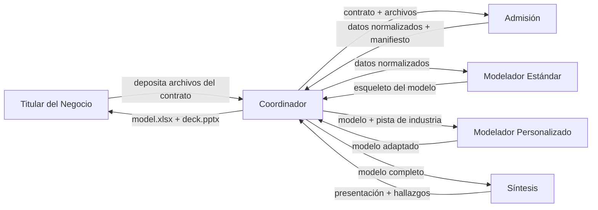

# Insignia — Procedimiento Operativo Estándar

## 1. Resumen ejecutivo

Este documento describe cómo un equipo automatizado de cinco agentes tomará cada uno de sus contratos con clientes desde el ingreso de los archivos hasta la entrega de la presentación estratégica final en aproximadamente tres días hábiles — el trabajo que hoy consume entre cinco y doce días de su calendario. Usted deposita los archivos del cliente en una ubicación compartida; el equipo clasifica y normaliza los datos, construye el modelo financiero estándar (Estado de Resultados, Balance General, Estado de Flujo de Efectivo, Valuación), superpone la capa específica de la industria con referencias sectoriales citadas y sintetiza una presentación estratégica de siete láminas con tres a cinco hallazgos respaldados por cifras concretas. Usted revisa antes de que cualquier cosa llegue al cliente. Usted sigue siendo la compuerta final.

El cambio de capacidad es material. Hoy, con un tiempo de entrega de cinco a doce días por contrato y aproximadamente veinticinco contratos al año, el proceso consume entre ciento veinticinco y trescientos días de trabajo suyos — dejando como máximo veinte días al año para crecimiento estratégico. Comprimir el tiempo de entrega a tres días hace factibles treinta y cinco o más contratos al año, despejando la lista de espera de clientes que ya ha tenido que rechazar y moviendo el negocio de "limitado por capacidad" a "limitado por demanda".

Cinco especialistas están detrás de esto. El **gerente de proyecto** enruta un contrato a través de la secuencia y ensambla las entregas finales. El **encargado de admisión** clasifica y normaliza los PDFs, hojas de Excel, CSVs y documentos de Word que recibe del cliente, heterogéneos en formato. El **modelador estándar** construye el núcleo financiero transversal que es idéntico para todos los clientes. El **especialista de industria** adapta el modelo al sector del cliente, completa los supuestos con referencias sectoriales y cita cada número. El **estratega** destila el modelo terminado en las tres a cinco cosas que realmente interesan al directorio del cliente.

Vea la sección §2 — "Cómo trabaja el equipo en conjunto" — para el flujo de principio a fin. El resto del documento recorre dónde corre cada paso, cómo se asegura, cómo maneja la incertidumbre, qué puede usted verificar y cuánto cuesta.

El punto de esta SOP en una sola oración: mueve a su negocio de una *IA de tareas repetitivas* — usar herramientas para corregir errores tipográficos — a una *IA arquitectónica* — usar herramientas para generar hallazgos estratégicos.

## 2. Cómo trabaja el equipo en conjunto

Un contrato por corrida. El gerente de proyecto es el único agente con el que usted interactúa — usted le entrega el contrato, él le entrega los productos finales. Entre esos dos momentos, él enruta el trabajo a cuatro especialistas en secuencia estricta: primero el encargado de admisión, luego el modelador estándar, luego el especialista de industria, luego el estratega. Cada especialista devuelve un reporte estructurado al gerente de proyecto; ninguno de ellos se comunica entre sí directamente. Esto importa porque cada traspaso es inspeccionable: si el encargado de admisión detecta datos faltantes, el pipeline se detiene ahí en vez de pasar entradas defectuosas corriente abajo.

La secuencia es deliberadamente lineal. El modelador estándar necesita los datos normalizados del encargado de admisión antes de construir el esqueleto. El especialista de industria necesita el esqueleto antes de superponer líneas específicas del sector. El estratega necesita el modelo completo antes de seleccionar los hallazgos. Paralelizar estos pasos no ahorraría tiempo en un solo contrato, y debilitaría las compuertas de calidad entre etapas.

En v1 el pipeline procesa un contrato a la vez. Si llegan dos contratos juntos, el segundo espera a que termine el primero — un retraso de tres días, no de nueve. El modo de procesamiento por lotes múltiples está en la hoja de ruta de v2 (véase §13).

## 3. Dónde corre

El pipeline corre en la infraestructura de nube administrada de Anthropic. Cada contrato arranca su propio contenedor aislado — un entorno de ejecución sellado y limpio, sin memoria de corridas previas y sin sistema de archivos compartido con ningún otro contrato. Cuando la corrida termina, el contenedor se destruye. Nada persiste del lado nuestro entre contratos, y nada persiste del lado de Anthropic tampoco. La siguiente corrida comienza desde cero.

Esta ausencia de estado es deliberada y es una característica, no una limitación. No hay contaminación cruzada entre clientes: los números de ayer no pueden filtrarse al modelo de hoy, y un error en un contrato no puede propagarse silenciosamente a otro. También significa que no existe ninguna copia persistente de los datos de su cliente fuera de la ventana activa de la corrida. Cuando el contenedor se destruye, también lo hacen todos los archivos intermedios y de salida que produjo.

Dos consecuencias prácticas se siguen de este diseño. Primero, el pipeline no es un asistente de chat — no recuerda conversaciones pasadas ni clientes pasados. Cada contrato arranca de cero. La memoria entre contratos (para que el pipeline pueda aprovechar una lección aprendida en un cliente de microfinanzas anterior al trabajar uno nuevo) está en la hoja de ruta de v2, pero en v1 cada contrato es su propio compromiso sellado. Segundo, las herramientas, plantillas y manuales sectoriales (*playbooks*) en los que los especialistas se apoyan se cargan frescos en cada contenedor al inicio de la corrida — no están horneados en servidores de larga duración. Si una plantilla cambia, la siguiente corrida la toma automáticamente.

Usted nunca necesitará iniciar sesión, monitorear o mantener la infraestructura de ejecución. Deposita archivos y recibe entregas; todo lo que hay en medio está gestionado.

## 4. Seguridad y confidencialidad

Cinco cosas determinan la postura de seguridad del pipeline. Vale la pena leerlas completas antes de firmar.

**Las credenciales se quedan de su lado.** En v1 el pipeline nunca toca sus credenciales de Microsoft, correo electrónico o bancarias. El único mecanismo de entrada es una carpeta compartida que usted llena manualmente con los archivos del contrato. En v2, cuando el pipeline lea directamente desde sus canales de Teams y OneDrive, el intercambio de credenciales se hace a través de la bóveda empresarial OAuth de Microsoft — nosotros nunca tenemos ni vemos sus contraseñas, tokens o secretos de actualización en ningún momento.

**Los archivos viven solo dentro de la corrida activa.** Los archivos de entrada se montan en modo solo lectura dentro del contenedor aislado — los especialistas no pueden modificar lo que usted subió. Los archivos intermedios y de salida se escriben en un directorio de trabajo específico de la sesión que existe solo durante la corrida. Cuando el contenedor se destruye al final de la corrida, cada copia de cada archivo se va con él. No hay depósito permanente, ni respaldo, ni archivo histórico del lado nuestro.

**Sin tráfico saliente silencioso.** Tres de los cinco especialistas — el gerente de proyecto, el encargado de admisión y el modelador estándar — no tienen ningún acceso a internet. Físicamente no pueden alcanzar nada fuera del contenedor. Dos especialistas sí alcanzan internet: el especialista de industria busca referencias sectoriales cuando no aplica un playbook local, y el estratega ocasionalmente consulta contexto de mercado público para enmarcar sus hallazgos. Cada búsqueda saliente queda registrada, y cada cifra que entra al modelo o a la presentación desde una fuente web lleva su URL en las notas de supuestos. Nada sobre sus clientes — ni nombres, ni cifras financieras, ni contenido de archivos — se transmite hacia afuera durante estas búsquedas. Los especialistas buscan *por* información; no comparten la suya.

**La residencia de datos es en Estados Unidos.** La infraestructura subyacente es la nube estadounidense de Anthropic. Antes de desplegar el pipeline con un cliente cuyo regulador (o cuya política interna) requiera procesamiento de datos dentro del país — común en algunos sectores financieros regulados de América Latina — confirme con el cliente que el procesamiento en Estados Unidos es aceptable. Esta es la única pregunta de residencia que vale la pena sacar a la luz al firmar, en vez de descubrirla a mitad del compromiso.

**Cada acción es auditable.** Ningún paso del pipeline opera en secreto. El registro de clasificación del encargado de admisión, las fuentes de supuestos del especialista de industria, las referencias de celdas del estratega — todos son archivos nombrados que usted puede abrir después de la corrida. La sección §8 cubre la trazabilidad en detalle.

## 5. Determinismo y reproducibilidad

Los pipelines impulsados por IA no son matemáticamente determinísticos como lo es una fórmula de Excel. Dos corridas sobre la misma entrada pueden producir salidas ligeramente diferentes, porque los modelos subyacentes eligen sus palabras y sus próximos pasos de forma probabilística. Vale la pena decir esto con claridad porque suena alarmante al primer paso — y luego explicar por qué, de hecho, está cuidadosamente ingeniado.

Diseñamos cada especialista para que sea tan reproducible como su trabajo lo permita. Algunos pasos son casi determinísticos por diseño; otros ejercen juicio porque el juicio *es* el objetivo. La siguiente tabla hace explícito el espectro.

| Agente | Determinismo | Qué significa esto para usted |
|---|---|---|
| Encargado de admisión | Casi determinístico | Mismo archivo de entrada → mismos datos normalizados |
| Modelador estándar | Matemática determinística, juicio en rellenos de supuestos | Mismas entradas → mismo esqueleto; cualquier valor por defecto queda marcado visiblemente |
| Especialista de industria | Juicio dentro de límites establecidos | Dos corridas pueden escoger fuentes distintas pero igualmente válidas; ambas quedan citadas |
| Estratega | Juicio (este es el objetivo) | Los tres a cinco hallazgos pueden diferir entre corridas; todos están respaldados por cifras en celdas específicas del modelo |

El estratega es el agente que más a menudo se malinterpreta aquí. *No debería* ser totalmente determinístico. El marco estratégico *es* el valor — si el estratega dijera exactamente lo mismo en cada corrida, sería una plantilla, no un asesor. Lo que *sí* es determinístico es el fundamento: cada hallazgo que el estratega presenta está ligado a una celda específica del modelo, a un número específico, y a un "y entonces qué" específico. Nada es jamás infalsificable. Usted puede estar en desacuerdo con el marco, pero siempre puede rastrear el número.

El especialista de industria está un nivel abajo. Cuando dos fuentes válidas de una referencia sectorial discrepan — por ejemplo, un reporte de industria dice que el WACC de microfinanzas es 14 % y otro dice 16 % — el especialista puede aterrizar en cualquiera de los dos números en corridas diferentes, y citará la que usó. El límite establecido es que no inventará un número y no seleccionará puntos medios sin fuente; si las fuentes discrepan sustancialmente, expone el rango y elige el punto medio con justificación.

El modelador estándar y el encargado de admisión son casi determinísticos. Dado el mismo archivo, el encargado de admisión lo clasificará igual y producirá la misma salida normalizada. Dadas las mismas entradas normalizadas, el modelador estándar producirá el mismo esqueleto. Cualquier valor por defecto que tenga que rellenar porque faltaban datos — por ejemplo, el costo de la deuda cuando los estados del cliente no lo reportan — queda marcado visiblemente en la hoja de `Supuestos` para que el especialista de industria (y usted) puedan sobrescribirlo.

En resumen: el pipeline es reproducible donde la reproducibilidad importa, y es basado en juicio donde el juicio es el entregable.

## 6. Controles de calidad

Cuatro mecanismos capturan errores antes de que una entrega salga del pipeline. Ninguno depende de que usted detecte el problema por sí mismo.

**Celdas de validación autoverificables en la hoja de cálculo.** Cada hoja financiera — Estado de Resultados, Balance General, Flujo de Efectivo — incorpora una celda de validación que devuelve `OK` o `UNBALANCED` con el delta exacto. El Balance General verifica que activos sean iguales a pasivos más patrimonio. El Estado de Flujo de Efectivo concilia su caja final contra la línea de caja del Balance General. Si alguna verificación falla por más de un centavo de la unidad de reporte, la corrida devuelve estado `failed` en vez de entregarle un modelo que parece completo pero está silenciosamente roto.

**Detención por campos faltantes.** Si el encargado de admisión detecta que falta un campo requerido — datos del Estado de Resultados 2023 ausentes cuando 2024 está reportado, un PDF escaneado sin texto extraíble, un balance que no se puede parsear — no adivina. Emite un paquete `blocked` de vuelta al gerente de proyecto, que se lo pasa a usted con los ítems faltantes nombrados específicamente. El pipeline se rehúsa a modelar sobre datos incompletos. Usted decide si perseguir al cliente, escalar, o proceder a pesar de la brecha. El costo de este diseño es que algunas corridas se detienen temprano; el valor es que ningún modelo malo se entrega silenciosamente.

**Supuestos con fuente citada.** Cada supuesto numérico que el especialista de industria inyecta — margen bruto sectorial, WACC, tasa de crecimiento terminal, múltiplo comparable — queda registrado en el archivo `assumption_notes.md` con su fuente. La fuente es o una ruta a un playbook sectorial local o una URL pública consultada vía búsqueda web en tiempo de ejecución. Si el especialista no puede encontrar una fuente, marca el supuesto explícitamente en vez de inventar un número. Usted puede auditar la capa de supuestos completa en un solo archivo.

**Celdas computadas con fórmulas únicamente.** Cada subtotal, total, razón y número derivado en la hoja de cálculo es una fórmula viva de Excel, nunca un valor fijo tecleado. La Utilidad Bruta es `Ingresos − COGS` como fórmula, no la respuesta pre-calculada por el especialista y escrita a mano. Esto importa por dos razones: primero, usted puede auditar cualquier celda computada haciendo clic y leyendo la fórmula; segundo, si usted o el cliente actualizan una cifra histórica después de la entrega, cada celda dependiente se actualiza correctamente.

## 7. Supervisión humana

Tres momentos explícitos lo ponen a usted en el circuito. Entre ellos, el pipeline corre sin supervisión — que es el punto de la automatización. Estos tres momentos son compuertas deliberadas, no pausas incidentales.

**Usted deposita los archivos.** Nada arranca hasta que usted coloca los archivos de entrada del contrato en la carpeta compartida. No hay admisión automática en v1, y no hay programador que arranque corridas en un horario. Esto es una decisión: usted controla qué entra al pipeline y cuándo. La admisión automática desde Teams / OneDrive está en la hoja de ruta de v2.

**Usted recibe un paquete `blocked` cuando los datos están incompletos.** Si el encargado de admisión detecta campos requeridos faltantes — PDFs solo escaneados, períodos ausentes, datos fuente sin cuadrar — el pipeline se detiene y el gerente de proyecto devuelve un paquete estructurado que nombra las brechas específicas. Usted decide entonces: perseguir al cliente por la pieza faltante, escalar internamente, o (rara vez) aceptar la brecha y pedirle al pipeline que proceda con advertencias explícitas. El pipeline no sustituirá silenciosamente defectos por datos financieros faltantes. Esta es la compuerta individual más fuerte contra entregar un mal producto — el pipeline se detiene en el momento en que duda de sus entradas, y usted decide.

**Usted revisa antes de la entrega.** Nada se envía directamente a su cliente. Cuando la corrida termina, el gerente de proyecto le devuelve a usted dos archivos: la hoja de cálculo completa y la presentación estratégica. Usted los abre, los lee, decide si enviarlos. El pipeline no tiene canal saliente hacia sus clientes.

Usted es la compuerta final. El pipeline es un equipo de especialistas trabajando para usted — no trabaja rodeándolo.

## 8. Trazabilidad

Cada corrida deja un rastro completo. Si alguien — su socio, su cliente, el directorio del cliente, un regulador — alguna vez pregunta "¿de dónde salió este número?", hay un archivo nombrado que responde. Nada es implícito.

Los artefactos que usted puede abrir después de cualquier corrida:

- **`manifest.json`** — la interpretación del encargado de admisión de cada archivo de entrada: qué tipo pensó que era cada archivo (estado financiero, documento identificatorio, clasificación de riesgo, investigación de mercado), la confianza de esa clasificación y cualquier marca de calidad que haya levantado durante la extracción.
- **`classification.json`** — el registro por archivo de cuáles herramientas lo leyeron (el lector de PDF, el lector de Excel, el parseo directo de CSV) y si alguno recurrió a métodos de extracción secundarios.
- **`assumption_notes.md`** — cada supuesto que el especialista de industria inyectó en el modelo, con su fuente. Una sección de playbook local, una URL pública, o una bandera explícita de que no había fuente disponible. Un solo archivo le dice cada número no obvio de la capa personalizada y por qué está ahí.
- **Celdas de validación dentro de la hoja de cálculo** — cada hoja financiera tiene una celda nombrada que reporta `OK` o `UNBALANCED` con el delta. Usted puede ver de un vistazo si el modelo pasó sus propias verificaciones internas.
- **`coordinator.log`** — la línea de tiempo de la corrida: cuándo se invocó cada especialista, qué entradas recibió, qué estado devolvió. Útil para análisis posterior si una corrida produjo un resultado inesperado.

Estos no son artefactos que usted deba leer en cada corrida. Existen para que cuando surja una pregunta — tres meses después de la entrega, durante una reunión de directorio, durante una auditoría del cliente — usted pueda responderla con un archivo, no con una suposición.

## 9. Estimación de costos de operación

Esta sección estima cuánto costará correr el pipeline contra la infraestructura de Anthropic por contrato y por año. No es *nuestra tarifa* — es el costo traspasable del servicio subyacente.

El pipeline cobra en tres dimensiones: tokens consumidos por los cinco especialistas, tiempo de ejecución de sesión (medido solo mientras una corrida está activamente procesando), y una pequeña tarifa por búsqueda web (usada por el especialista de industria). Anthropic publica las tres tarifas; se citan abajo.

### Desglose por contrato (estimado, basado en el contrato de Tafi)

| Concepto | Costo estimado |
|---|---:|
| Uso de tokens — cinco agentes combinados (~918.000 de entrada + 54.000 de salida en 142 turnos) | USD 5,67 |
| Tiempo de ejecución de sesión (~3 horas activas a USD 0,08/hora) | USD 0,24 |
| Búsqueda web (~10 consultas de referencias sectoriales a USD 10 por mil) | USD 0,10 |
| **Total por contrato** | **~USD 6,00** |

El componente caro es el uso de tokens, y dentro de eso los tres agentes de modelado (modelador estándar, especialista de industria, estratega) representan aproximadamente el noventa y tres por ciento de la factura de tokens porque corren en Opus — el modelo más capaz de Anthropic — y corren por la mayor cantidad de turnos. El encargado de admisión y el gerente de proyecto corren en Sonnet y en conjunto están por debajo de cincuenta centavos por contrato.

### Proyección anual

Usando USD 6 por contrato como costo unitario, el gasto anual de API escala linealmente con el volumen:

| Contratos anuales | Escenario | Costo anual de API |
|---:|---|---:|
| 25 | Línea base actual | ~USD 150 |
| 35 | Cola despejada, corto plazo | ~USD 210 |
| 50 | Capacidad duplicada | ~USD 300 |
| 75 | Meta completa de 3× | ~USD 450 |

Para contexto: a las tarifas del flujo manual actual, el pipeline reemplaza entre ciento veinticinco y trescientos días hábiles al año de su tiempo (véase el diagnóstico para el desglose de horas). El costo de API a cualquier volumen razonable es una pequeña fracción del trabajo que sustituye.

### Metodología y salvedades honestas

Lo que se midió directamente:
- Tarifas publicadas por Anthropic, consultadas el 2026-04-16 desde la página de precios y la documentación de plataforma: Opus entrada USD 5 / salida USD 25 por millón de tokens, Sonnet entrada USD 3 / salida USD 15 por millón de tokens, ejecución de sesión USD 0,08 por hora activa, búsqueda web USD 10 por mil consultas.
- Los tamaños de los prompts de sistema de los cinco agentes (5.655 tokens combinados), el tamaño de extracción de texto completo del PDF de Tafi (15.961 tokens), y el tamaño del resumen pandas del CSV de cartera de Tafi (2.718 tokens). Medidos vía el endpoint `count_tokens` de Anthropic y corridas locales de extracción.

Lo que queda estimado:
- Conteo de turnos por agente (~10 a ~45 dependiendo de la complejidad).
- Crecimiento acumulado del historial a lo largo de una corrida larga.
- Promedio de tokens de salida por turno.
- Tamaño de un paquete de resultado de búsqueda web.

La estimación previa a la medición tenía una banda de incertidumbre de ±30–50 %. Después de la medición la banda se ajusta a aproximadamente **±15–25 %**. La incertidumbre restante se resuelve solo con una corrida en vivo — razón por la cual el primer contrato real de Tafi debe instrumentarse para capturar valores reales y reemplazar estas proyecciones.

### Optimización ya en camino

La funcionalidad de caché de prompts de Anthropic, cuando está habilitada, reduce los tokens de entrada con acierto de caché a USD 0,50 por millón en Opus y USD 0,30 por millón en Sonnet — un décimo de la tarifa estándar. Como los cinco prompts de sistema son estáticos entre corridas, cachearlos es prácticamente trabajo de ingeniería gratuito y debería reducir el costo por contrato en aproximadamente diez a quince por ciento. Se habilitará antes de la primera corrida de producción.

### Aclaración

Claude Managed Agents está en disponibilidad general, pero las tarifas mencionadas se consultaron en un punto en el tiempo y pueden cambiar. Hay descuentos por volumen disponibles por encima de ciertos umbrales a través de ventas empresariales; la proyección anterior asume tarifas de lista. Nada en esta sección es una cotización — es una estimación de planificación destinada a darle a usted una noción de orden de magnitud. El primer contrato en vivo producirá números medidos que la reemplazarán.

## 10. Límites de v1

Esta es la lista honesta de lo que el pipeline *todavía no* hace. El encuadre importa: cada uno de estos es un límite deliberado de v1, y cada uno tiene un sucesor v2 específico que cierra la brecha. La sección §13 describe la hoja de ruta v2 en detalle.

**La admisión de archivos es manual.** Hoy usted deposita los archivos del contrato en una carpeta compartida; el pipeline los toma de ahí. No hay lectura automática desde Teams, OneDrive ni correo. Esto preserva el paso humano actual en el que usted decide qué entra — lo que también significa que la ventana de clasificación manual de cuatro días del diagnóstico no se elimina aún, solo se reduce al tiempo que le toma a usted depositar los archivos. *v2 agrega*: lecturas directas y seguras en credenciales desde sus canales de Teams y carpetas de OneDrive.

**Los dashboards de Power BI no se refrescan automáticamente aún.** El estratega produce la presentación y el modelo; no empuja aún métricas clave hacia un dashboard en vivo orientado a los socios. Las vistas recurrentes de Power BI siguen siendo un paso de exportación manual. *v2 agrega*: refresco autenticado de datasets de Power BI desde la salida del estratega.

**Cada contrato parte desde cero.** El pipeline no tiene memoria entre contratos. Si el especialista de industria investiga referencias sectoriales de microfinanzas en el Contrato A, esos hallazgos exactos no se reutilizan automáticamente en el Contrato B del mismo sector — la búsqueda se corre de nuevo. Cada corrida es un compromiso aislado. *v2 agrega*: un almacén de memoria entre contratos que cachea hallazgos sectoriales, notas de contexto de cliente y lecciones de corridas previas, indexado por industria e invalidado cuando queda obsoleto.

**Un contrato a la vez.** Si llegan dos contratos simultáneamente, el segundo espera a que el primero termine. Una corrida sola toma aproximadamente tres horas de cómputo; dos corridas seriales toman seis. *v2 agrega*: modo por lotes con paralelismo a nivel de sesión.

**La compuerta de calidad es su revisión, no una rúbrica automática.** Los controles internos de calidad del pipeline (verificaciones de balance, supuestos con fuente, celdas con solo fórmulas) capturan errores mecánicos, pero no califican el entregable contra una rúbrica de calidad estratégica. Los hallazgos están respaldados por números pero no puntuados automáticamente contra un estándar de calidad de directorio. *v2 agrega*: una autoverificación calificada por rúbrica sobre la calidad del modelo y la calidad de la presentación antes de la entrega.

**Los playbooks de industria son mínimos.** v1 envía un único playbook genérico de respaldo. Cuando un sector no tiene un playbook dedicado (microfinanzas, por ejemplo), el especialista de industria recurre a fuentes web públicas — más lento, a veces menos preciso y más caro por contrato debido al volumen de búsquedas. *v2 agrega*: una biblioteca curada de playbooks por sector (servicios financieros, logística, retail, SaaS, agroindustria, infraestructura) que eliminan la mayoría de las rondas de búsqueda web y aceleran la capa personalizada.

Ninguna de estas brechas impide que el pipeline entregue valor completo en v1. Son los bordes conocidos de lo que la primera versión puede hacer, declarados con claridad para que usted pueda planificar en torno a ellos.

# Parte II — Los agentes

## Coordinador — el gerente de proyecto

El coordinador es el único agente con el que usted interactúa directamente. Piénselo como el gerente de proyecto de un equipo de cuatro personas: recibe el encargo de usted, asigna cada parte del trabajo al especialista correcto, recoge sus reportes, verifica que nada falte, y le entrega a usted los productos terminados. No hace trabajo de modelado él mismo — lo enruta.

### Qué lee y qué entrega

**Lee:** el identificador del contrato, la lista de archivos de entrada que usted depositó, y el nombre del cliente.

**Le entrega a usted:** un paquete único con el modelo financiero completo (`model.xlsx`), la presentación estratégica (`deck.pptx`), una lista de hallazgos clave, y un estado — `delivered`, `blocked_on_client` o `failed`. Más un registro de la línea de tiempo de lo que pasó durante la corrida.

### Cómo piensa

El coordinador sigue una secuencia estricta: admisión primero, luego modelado estándar, luego superposición personalizada, luego síntesis. Cada especialista devuelve un reporte estructurado; el coordinador inspecciona el campo de estado y decide si continuar. Si el encargado de admisión detecta datos faltantes, el coordinador se detiene y devuelve `blocked_on_client` con las brechas específicas nombradas — no intenta sustituir por valores por defecto ni llamar al siguiente especialista sobre una mala base. Si cualquier otro especialista falla a mitad de corrida, el coordinador corta la secuencia y reporta `failed` con el error corriente arriba. Nunca inventa salidas para enmascarar una corrida parcial.

### Qué hay bajo el capó

- **Modelo:** Sonnet. El coordinador es un enrutador, no un modelador — necesita juicio para la orquestación, no profundidad analítica. Sonnet es la compensación correcta entre costo y rendimiento aquí.
- **Herramientas:** solo lectura y escritura. No tiene shell bash, ni acceso a internet, ni capacidad de abrir o modificar archivos de Excel. Su único trabajo es enrutar, y sus herramientas están dimensionadas en consecuencia.
- **Habilidades:** ninguna. Las habilidades son capacidades especializadas (lectura de PDF, edición de Excel, generación de presentaciones) reservadas a los agentes que las necesitan.

### Determinismo

Altamente determinístico. Dadas las mismas entradas y las mismas salidas de los especialistas, el coordinador enrutará en el mismo orden, aplicará las mismas condiciones de detención y producirá el mismo paquete final. Es el agente más predecible del pipeline.

### Postura de seguridad

El coordinador no tiene acceso saliente a internet. Lee las entradas que usted proporcionó, escribe el paquete final y escribe un registro de estado al directorio de salida de la sesión. Nada de lo que hace toca algo fuera del contenedor activo de la corrida.

### Modos de falla

- **Admisión bloqueada:** el encargado de admisión devuelve `blocked` con campos faltantes. El coordinador lo pasa directamente a usted como `blocked_on_client`. Usted decide qué hacer después.
- **Falla de un trabajador:** cualquier especialista devuelve `failed`. El coordinador corta, expone el error y reporta `failed` — sin reintento silencioso, sin caída a valores por defecto.
- **Reporte mal formado:** muy raro, pero si un especialista devuelve un reporte que el coordinador no puede parsear, la corrida falla limpiamente en vez de proceder sobre un paquete mal interpretado.

### Qué puede usted verificar después de una corrida

- `coordinator.log` — la línea de tiempo de invocaciones de especialistas y los estados que devolvieron.
- El paquete final — un reporte tipo JSON que resume el resultado de la corrida, con rutas a cada entregable.

## Admisión — el encargado de admisión

El encargado de admisión es el primer especialista que ve los archivos del contrato. Su trabajo es la labor en la que usted gasta hoy cuatro días: tomar lo que sea que el cliente envió — PDFs de estados financieros, hojas de Excel, CSVs de cartera, la narrativa ocasional en Word — y convertirlo en un conjunto de datos limpio y listo para modelar. Clasifica cada archivo, extrae los datos estructurados, los normaliza a una forma canónica, y marca cualquier cosa faltante o sospechosa.

### Qué lee y qué entrega

**Lee:** cada archivo que usted deposite para el contrato, en cualquier formato que el cliente haya enviado.

**Entrega:** un conjunto de datos normalizado organizado en tres CSVs canónicos (Estado de Resultados, Balance General, Flujo de Efectivo), un archivo de metadata de la entidad, un archivo de supuestos narrativos, y un manifiesto que cataloga cada entrada, cada extracción y cada marca de calidad. El manifiesto es lo que los agentes corriente abajo leen; los archivos crudos subyacentes nunca vuelven a tocarse.

### Cómo piensa

Para cada archivo intenta determinar: *¿qué es esto?* (estado financiero, documento de identidad, clasificación de riesgo, investigación de mercado, otra cosa), *¿qué tan seguro estoy?*, y *¿puedo extraer el contenido estructurado de manera confiable?* Para PDFs prefiere una extracción directa de texto; si el PDF está escaneado o es solo imagen, recurre a un método de extracción más agresivo y marca la situación. Para hojas de Excel lee cada pestaña. Para CSVs lee directamente. Para cualquier cosa que no pueda clasificar o extraer con confianza, marca el archivo en vez de adivinar.

La disciplina crucial es que el encargado de admisión nunca inventa datos. Si falta un campo requerido — un período de reporte, un lado del balance, una partida — lo dice y detiene el pipeline en vez de fabricar defectos. Así se elimina el punto de dolor del diagnóstico de "archivos rotos, contacto manual": usted sigue haciendo el contacto cuando hace falta, pero solo cuando el pipeline ha identificado una brecha específica y nombrada.

### Qué hay bajo el capó

- **Modelo:** Sonnet. La clasificación y la normalización requieren juicio pero no razonamiento analítico profundo; Sonnet es rápido y eficiente en costo para esta carga.
- **Herramientas:** bash, lectura, escritura, edición. Bash le permite invocar librerías especializadas cuando las habilidades estándar no bastan (por ejemplo, correr un respaldo OCR sobre un PDF escaneado).
- **Habilidades:** lector de PDF, lector de Excel, lector de Word. Tres capacidades especializadas, una por formato común.

### Determinismo

Casi determinístico. Dados los mismos archivos de entrada, el encargado de admisión los clasifica igual, extrae el mismo texto, y produce los mismos CSVs normalizados. La única fuente de variación es el juicio a pequeña escala sobre archivos ambiguos — que siempre queda expuesto en los puntajes de confianza del manifiesto, nunca oculto.

### Postura de seguridad

Sin acceso saliente a internet. El encargado de admisión lee lo que usted montó en el contenedor de la corrida y escribe la salida normalizada en el mismo directorio de sesión del contenedor. Nada sale.

### Modos de falla

- **Campos requeridos faltantes** — devuelve estado `blocked` con las brechas específicas nombradas. El coordinador lo expone a usted como `blocked_on_client`.
- **PDF escaneado o solo imagen** — intenta una extracción directa, detecta que casi no salió texto (menos de cincuenta caracteres por página en promedio) y recurre a una extracción basada en layout. Si esa aún no arroja nada, marca el archivo como ilegible y se detiene.
- **Datos fuente desbalanceados o inconsistentes** — levanta una bandera de calidad en el manifiesto con severidad; el coordinador decide si proceder o detenerse según la severidad.
- **Tipo de archivo ambiguo** — clasifica con baja confianza y lo marca; no procede sobre archivos que no pudo categorizar con confianza.

### Qué puede usted verificar después de una corrida

- `manifest.json` — el catálogo completo: archivos leídos, tipos asignados, puntajes de confianza, marcas de calidad, campos faltantes.
- `classification.json` — el registro por archivo de qué método de extracción tuvo éxito y cualquier respaldo que se disparó.
- El directorio `normalized/` — tres CSVs y un archivo de entidad que usted puede abrir en Excel para verificar que el pipeline vio correctamente los números del cliente.

## Modelador estándar — el modelador transversal

El modelador estándar construye el núcleo financiero que es idéntico entre todos sus clientes: Estado de Resultados, Balance General, Flujo de Efectivo y Valuación. Este es el trabajo que el diagnóstico identifica como la capa transversal — la misma estructura aplicada contrato tras contrato, difiriendo solo en los números que entran en ella. Automatizar esta capa es la recuperación de tiempo más grande del pipeline.

### Qué lee y qué entrega

**Lee:** el conjunto normalizado producido por el encargado de admisión (tres CSVs canónicos, el archivo de entidad, la narrativa de supuestos) y la plantilla Excel del pipeline (un esqueleto estructurado con las cuatro hojas del núcleo, fórmulas preconstruidas y marcadores reservados para la superposición del especialista de industria).

**Entrega:** una hoja de cálculo `model.xlsx` poblada con las cuatro hojas del núcleo, cada subtotal como una fórmula viva, una celda autoverificable por hoja que devuelve `OK` o `UNBALANCED`, y una hoja de `Supuestos` que lista cualquier valor por defecto que haya tenido que rellenar cuando los datos fuente eran incompletos.

### Cómo piensa

El modelador estándar nunca reconstruye el núcleo financiero desde cero. Abre la plantilla y la rellena, preservando las direcciones de celdas, los rangos con nombre y las referencias de fórmulas entre hojas de las que depende el especialista de industria corriente abajo. Esto es una disciplina con una razón específica: si la estructura de la plantilla se desplaza, la superposición cuidadosamente colocada por el especialista de industria se rompe silenciosamente. El modelador estándar es, por lo tanto, un rellenador, no un reconstructor.

Cada celda computada — utilidad bruta, EBITDA, flujo operativo, cada subtotal — es una fórmula viva de Excel, no un número fijo. Usted puede hacer clic en cualquier celda y ver la fórmula que la produjo. Los números fijos aparecen solo en celdas de entrada donde viven los datos históricos reportados por el cliente.

Cuando a los datos fuente les falta una pieza que el modelo necesita (por ejemplo, costo de la deuda para la línea de gasto por interés), el modelador estándar no adivina. Inserta una fórmula que referencia una celda en la hoja de `Supuestos` y marca esa fila con un marcador visible `TODO(bespoke)`. El especialista de industria más tarde completa el número real; si no puede, ese supuesto queda expuesto a usted.

### Qué hay bajo el capó

- **Modelo:** Opus. Construir un modelo de cuatro estados estructuralmente correcto e internamente consistente requiere razonamiento analítico profundo — el balance debe cuadrar, el flujo debe conciliarse, el DCF debe usar mecánicas sensatas de valor terminal. Este es el trabajo que usted no delegaría a un analista junior en su primer día; corre en Opus.
- **Herramientas:** bash, lectura, escritura, edición. Bash se usa para correr la librería de edición de Excel que preserva los rangos con nombre y las referencias de fórmulas de manera confiable — la habilidad de Excel por sí sola puede descartar silenciosamente esas estructuras al guardar.
- **Habilidades:** lector de Excel (usado solo para inspección; las escrituras van por la ruta de bash más cuidadosa).

### Determinismo

Matemática determinística, juicio ligero en valores por defecto de supuestos. Dadas las mismas entradas normalizadas y la misma plantilla, el modelador estándar produce el mismo Estado de Resultados, Balance General, Flujo de Efectivo y Valuación — mismas direcciones de celdas, mismas fórmulas, mismos resultados de validación. La única variación es la elección de valor por defecto para cualquier entrada faltante, y esas siempre quedan expuestas con un marcador `TODO(bespoke)`, así que nada queda oculto.

### Postura de seguridad

Sin acceso saliente a internet. El modelador estándar lee el conjunto normalizado y la plantilla, escribe la hoja de cálculo y corre su validación interna. Ni alcanza internet ni sale del contenedor.

### Modos de falla

- **El balance no cuadra** — la celda de validación devuelve `UNBALANCED` con el delta exacto. Si el delta excede un centavo de la unidad de reporte, el modelador estándar devuelve un estado `failed` en vez de entregar un modelo roto.
- **El flujo de efectivo no concilia con el balance** — mismo resultado: falla en vez de entrega silenciosa.
- **Plantilla faltante o corrupta** — falla temprano con un error claro; no intenta reconstruir desde cero (el contrato del especialista de industria con la plantilla depende de que se preserve exactamente).

### Qué puede usted verificar después de una corrida

- La hoja de cálculo misma. Haga clic en cualquier celda computada; ve la fórmula. Revise las celdas de validación en cada hoja; leen `OK` si la matemática interna es consistente.
- La hoja de `Supuestos`. Cualquier fila marcada `TODO(bespoke)` es un valor por defecto que el modelador estándar insertó porque los datos fuente no lo proporcionaron — estos son los lugares que el especialista de industria refinará después.

## Modelador personalizado — el especialista de industria

El especialista de industria adapta el modelo estándar al sector específico del cliente. Su trabajo es la capa personalizada que describe el diagnóstico: partidas apropiadas al sector que no existen en el núcleo transversal, supuestos de referencia extraídos de investigación de industria, múltiplos de valuación calibrados a los comparables correctos. Es el paso en que un esqueleto financiero genérico se convierte en un modelo que le habla al negocio real del cliente.

### Qué lee y qué entrega

**Lee:** la hoja de cálculo poblada por el modelador estándar, los supuestos narrativos del cliente, el nombre del cliente, y una pista de industria opcional de parte suya (por ejemplo, "microfinanzas" o "logística"). También puede consultar un playbook sectorial — un documento de referencia pre-investigado que contiene referencias sectoriales y convenciones de partidas — cuando existe uno para el sector del cliente.

**Entrega:** la misma hoja de cálculo, ahora actualizada con partidas específicas del sector en los bloques personalizados reservados, una sección `industry_benchmarks` poblada con los cinco KPIs más relevantes, una sección `bespoke_assumptions` poblada con WACC y crecimiento terminal, una lista de múltiplos comparables, y un archivo `assumption_notes.md` que cita la fuente de cada número que inyectó.

### Cómo piensa

El especialista de industria primero confirma el sector. Usa la pista de industria si usted la proporcionó; si no, la infiere del nombre del cliente, los supuestos narrativos y el patrón del propio Estado de Resultados. Si hay incertidumbre, usa búsqueda web para resolver la clasificación y registra su razonamiento en una nota de clasificación.

Luego consulta un playbook sectorial local cuando existe uno. Si aplica un playbook — digamos, uno de logística o uno de SaaS — es la fuente autoritativa: referencias sectoriales, partidas requeridas, convenciones de múltiplos comparables. Cuando no existe un playbook (microfinanzas, por ejemplo, en v1), el especialista recurre a investigación web pública. Cada cifra que extrae de la web queda citada con una URL fuente, y cada supuesto que inyecta queda registrado en `assumption_notes.md` con procedencia.

Crucialmente, el especialista de industria nunca reescribe el núcleo del modelador estándar. Agrega en bloques reservados y rellena rangos con nombre pre-designados. Si el Estado de Resultados real del cliente contradice el playbook (ingresos por servicios donde el playbook esperaba ingresos por productos), el especialista confía en los datos del cliente y nota la discrepancia en vez de forzar la forma del playbook.

### Qué hay bajo el capó

- **Modelo:** Opus. La clasificación de industria, la selección de referencias sectoriales entre fuentes públicas conflictivas y el establecimiento juicioso de supuestos requieren razonamiento analítico fuerte. Opus es el modelo que se comporta más como el analista senior al que usted de otro modo asignaría este trabajo.
- **Herramientas:** bash, lectura, escritura, edición, búsqueda web, lectura web. Las dos herramientas web son las que le permiten recuperar referencias públicas cuando un playbook no está disponible; cada recuperación queda registrada.
- **Habilidades:** lector de Excel (para inspección), lector de PDF (reservado para v2 cuando el especialista podría releer documentos fuente para secciones narrativas de riesgo; sin uso en v1).

### Determinismo

Juicio dentro de límites establecidos. Dos corridas sobre el mismo cliente pueden escoger fuentes distintas pero igualmente válidas cuando las referencias publicadas discrepan — si un reporte de industria dice que el WACC de microfinanzas es catorce por ciento y otro dice dieciséis, el especialista puede aterrizar en cualquiera en corridas distintas, y citará la que usó. El límite establecido es que cita cada número y marca cada rango dentro del cual escogió un punto medio.

### Postura de seguridad

Este es uno de los dos agentes con acceso saliente a internet (el otro es el estratega). Las consultas de búsqueda web son sobre información pública de la industria — referencias sectoriales, empresas comparables, investigación publicada. Nada sobre su cliente o los datos de su cliente se envía hacia afuera como parte de estas búsquedas. El especialista busca *por* información; no comparte la suya. Cada búsqueda y cada URL recuperada queda registrada.

### Modos de falla

- **Sin playbook y la búsqueda web falla o no devuelve nada útil** — el especialista marca el supuesto faltante en `assumption_notes.md` e inserta un marcador de posición conservador en vez de inventar un número. Usted ve la brecha explícitamente.
- **El playbook contradice los datos del cliente** — confía en el cliente, nota la discrepancia, procede.
- **Regresión de validación** — después de agregar la capa personalizada, el especialista vuelve a correr las verificaciones de balance y flujo. Si alguna regresó de `OK` a `UNBALANCED`, la repara o la revierte en vez de entregar un modelo roto.

### Qué puede usted verificar después de una corrida

- `assumption_notes.md` — cada supuesto que el especialista agregó, con su fuente (una ruta de playbook o una URL).
- `industry_classification.md` — la decisión de sector y la evidencia detrás de ella.
- La hoja de cálculo actualizada misma. Las hojas del núcleo del modelador estándar todavía leen `OK` en sus celdas de validación; las nuevas filas personalizadas están claramente etiquetadas; cada número remonta hacia atrás o a los datos de entrada o al archivo de notas.

## Síntesis — el estratega

El estratega es el agente que el diagnóstico marca como el mayor punto de dolor sin resolver: el paso donde un modelo financiero completo se convierte en una presentación estratégica que responde la pregunta que al directorio del cliente realmente le importa. "¿Cuáles son las tres a cinco cosas que necesitamos saber?" El diagnóstico llama a esto la transición de *IA de tareas repetitivas* (corrigiendo errores) a *IA arquitectónica* (generando hallazgos). El estratega es donde ocurre esa transición.

### Qué lee y qué entrega

**Lee:** la hoja de cálculo completa (núcleo transversal más superposición personalizada), el nombre del cliente, y la plantilla de presentación estratégica — un esqueleto de siete láminas con títulos de marcador y diseño consistente con la marca.

**Entrega:** un archivo `deck.pptx` con la presentación estratégica terminada, más una lista estructurada de los hallazgos clave que seleccionó, cada uno ligado a una celda específica del modelo con un "y entonces qué" de una línea.

### Cómo piensa

El estratega se rehúsa a narrar el modelo. Narrar el modelo es lo que hacen los analistas juniors — recorrer cada hoja, reafirmar cada número. El directorio no necesita narración. Necesita destilación.

El estratega arranca computando las respuestas a cuatro preguntas de encuadre:

- **Desempeño** — ¿cómo le está yendo al negocio contra su propia historia y contra referencias sectoriales?
- **Salud** — resiliencia del balance: apalancamiento, liquidez, ciclo de capital de trabajo.
- **Trayectoria** — ¿qué dice la proyección, y a qué supuesto es más sensible?
- **Valor** — ¿qué implica el DCF más los comparables, y cuál es el rango?

A partir de las respuestas, rankea hallazgos candidatos y se queda con tres a cinco. Un hallazgo debe pasar tres pruebas: (1) un número específico lo respalda, (2) hay un "y entonces qué" claro, y (3) un miembro del directorio realmente lo discutiría. Todo lo que falla cualquiera de las tres pruebas se descarta, no se suaviza.

La presentación misma se construye cargando la plantilla y poblando cada lámina. La lámina de Resumen Ejecutivo (lámina dos) es la barra de calidad: si el Titular del Negocio — o el cliente del Titular del Negocio — lee solo esa lámina, debe saber qué importa y qué hacer al respecto.

Cuando el DCF es frágil — es decir, un cambio de dos por ciento en WACC cambia la valuación en más de veinticinco por ciento — el estratega lo dice en la lámina de Valor. La fragilidad es un hallazgo, no un defecto que esconder.

### Qué hay bajo el capó

- **Modelo:** Opus. El juicio estratégico es el entregable aquí. Rankear hallazgos candidatos, elegir qué descartar, escribir marcos nítidos a nivel de directorio — este es el trabajo que más se beneficia del modelo más capaz de Anthropic.
- **Herramientas:** bash, lectura, escritura, edición, búsqueda web. Bash corre la librería de generación de presentaciones (la habilidad de presentaciones no puede cargar una plantilla existente y rellenar marcadores; eso requiere control programático directo). La búsqueda web está disponible para contexto de mercado público al enmarcar un hallazgo.
- **Habilidades:** lector de Excel (para extraer KPIs del modelo terminado), lector de presentaciones (reservado para uso futuro al inspeccionar presentaciones terminadas).

### Determinismo

Juicio — y ese es el punto. Dos corridas sobre el mismo modelo pueden seleccionar conjuntos de hallazgos ligeramente distintos y enmarcarlos de forma distinta. Esto no es un defecto. El estratega es el asesor del equipo, y un asesor que dice exactamente lo mismo cada vez es una plantilla, no un asesor. Lo que sí es determinístico es el fundamento: cada hallazgo cita una celda específica, un número específico y un "y entonces qué" específico. Nada es nunca infalsificable. Usted puede estar en desacuerdo con el encuadre; siempre puede rastrear el número.

### Postura de seguridad

El estratega lee el modelo (que nunca sale del contenedor), puebla la presentación y ocasionalmente busca en la web pública contexto de mercado para enmarcar un hallazgo. Como con el especialista de industria, nada sobre los datos del cliente se envía hacia afuera durante las consultas de búsqueda, y cada fuente web queda citada en las notas del presentador de la presentación.

### Modos de falla

- **No puede computar las respuestas de encuadre** — por ejemplo, si la hoja de cálculo falla una verificación de validación a mitad de lectura, el estratega aborta en vez de producir una presentación sobre un modelo roto.
- **No puede identificar tres hallazgos dignos del directorio** — expone el problema explícitamente en vez de rellenar con contenido débil. Esto es raro; cuando pasa, usualmente es porque los datos subyacentes son demasiado incompletos para soportar comentario estratégico.
- **Plantilla faltante** — falla claramente.

### Qué puede usted verificar después de una corrida

- La presentación misma. Abra `deck.pptx`, lea la lámina de Resumen Ejecutivo. Esa es la prueba: ¿responde "qué importa y qué hacer al respecto"?
- La lista de hallazgos devuelta en el paquete — tres a cinco elementos, cada uno con un titular, un número, la celda fuente en el modelo y un "y entonces qué" de una línea.
- Notas del presentador en cada lámina — cada cifra de fuente web queda citada ahí con la URL.

# Parte III — Trabajando juntos

## 11. Su flujo de trabajo como Titular del Negocio

Su día a día con el pipeline es intencionalmente pequeño. Tres pasos.

**Paso 1 — Depositar los archivos.** Cuando llega un nuevo contrato, usted coloca sus archivos de entrada en la carpeta compartida designada para ese contrato. Lo que sea que el cliente haya enviado, en el formato que haya sido — PDFs, hojas de Excel, CSVs, narrativas en Word. Usted no renombra, reformatea ni pre-clasifica nada. Ese trabajo pertenece al encargado de admisión.

**Paso 2 — Recibir el paquete.** Aproximadamente tres horas más tarde (menos si el contrato es simple, más si el especialista de industria tiene que investigar un sector desconocido), el pipeline le devuelve un paquete único. Lo más común: contiene la hoja de cálculo completa, la presentación estratégica y una lista de hallazgos clave. Ocasionalmente devuelve `blocked_on_client` con una brecha específica nombrada — un período de reporte faltante, un PDF escaneado ilegible, un balance que no se puede parsear — y usted decide si perseguir al cliente o proceder con advertencias explícitas.

**Paso 3 — Revisar y enviar.** Usted abre la hoja de cálculo y la presentación, verifica que la lámina de Resumen Ejecutivo lea como algo que usted mismo le diría al directorio del cliente, firma el visto bueno y envía al cliente. Nada se envía al cliente por el pipeline. Usted es la compuerta final.

Ese es todo el modelo de interacción. No hay dashboards que monitorear, no hay infraestructura que atender, no hay cola que gestionar. Archivos que entran, paquete que sale, su revisión, listo.

## 12. Qué necesitamos de usted

Tres cosas, en orden descendente de frecuencia.

**Por contrato: los archivos de entrada, depositados con prontitud.** El pipeline es tan rápido como su cadencia de admisión. Una vez que los archivos están en la carpeta compartida, la corrida arranca en cuestión de minutos y termina en cuestión de horas. Si los archivos llegan con cuentagotas durante una semana, el tiempo de entrega de tres días se convierte en un tiempo de entrega de una semana y pico — no por el pipeline sino por la pausa de admisión. Sugerimos una regla: cuando un cliente entregue archivos, entren a la carpeta ese mismo día.

**Sobre un paquete bloqueado: una decisión de aclaración en 48 horas.** Cuando el encargado de admisión detecta datos faltantes, el pipeline se detiene y devuelve un paquete `blocked_on_client`. Ese paquete es útil solo si la brecha de información se resuelve. Sugerimos un nivel de servicio blando de su lado: cuando reciba un paquete bloqueado, usted o persigue al cliente o decide proceder con advertencias en dos días hábiles. Pausas más largas se acumulan y recrean el problema de acumulación del antiguo flujo dentro del nuevo pipeline.

**En la entrega: firma antes de enviar.** Nada se envía automáticamente al cliente. Cada entrega pasa primero por su revisión. Esa es su marca profesional, no la nuestra — pero el pipeline solo funciona si el paso de firma realmente ocurre en vez de saltarse bajo presión de tiempo. Recomendamos reservar un espacio de treinta minutos de revisión por contrato en su calendario.

Más allá de estas tres cadencias, el pipeline es autosuficiente. No necesita mantenimiento, re-entrenamiento ni supervisión.

## 13. Hoja de ruta v2

Las brechas de la sección §10 no son estructurales. Cada una tiene una funcionalidad planeada de v2 diseñada para cerrarla. Estas no son especulativas; ya están dimensionadas y acotadas. La lista siguiente está ordenada por impacto, no por orden de implementación.

### Admisión automática desde Microsoft Teams y OneDrive

El pipeline lee archivos de contratos directamente desde los canales de Teams y carpetas de OneDrive que usted ya usa, a través de la bóveda empresarial de credenciales de Microsoft. Los archivos que llegan al canal de admisión disparan una corrida automáticamente. Las credenciales nunca salen de la bóveda de Microsoft; el pipeline nunca ve sus contraseñas o tokens.

*Elimina*: el paso manual de depositar archivos y la latencia de admisión que actualmente limita el tiempo total de entrega.

### Refresco de dashboards de Power BI desde la salida de síntesis

El estratega empuja métricas seleccionadas — los mismos números que anclan los hallazgos de la presentación — a un dataset vivo de Power BI después de cada corrida. Las vistas de socios se refrescan automáticamente; los dashboards mensuales recurrentes se convierten en un subproducto del pipeline en vez de una exportación manual separada.

*Elimina*: la tarea recurrente de "generar vistas de Power BI para socios" que actualmente está fuera del pipeline.

### Biblioteca de playbooks sectoriales

Una biblioteca curada de playbooks por sector — servicios financieros, logística, retail, SaaS, agroindustria, infraestructura y otros — reemplaza el respaldo de investigación web que el especialista de industria usa hoy cuando no existe un playbook. Cada playbook contiene referencias sectoriales validadas, partidas requeridas y convenciones de múltiplos comparables.

*Elimina*: la mayoría de las rondas de búsqueda web del especialista de industria, acelerando la capa personalizada y ajustando su perfil de costo.

### Memoria entre contratos

Una memoria estructurada de corridas previas, indexada por sector y tipo de cliente. Cuando el especialista de industria enfrenta un nuevo contrato de microfinanzas, aprovecha hallazgos de compromisos previos de microfinanzas (referencias, pitfalls comunes de calidad de datos, supuestos específicos del sector que funcionaron) en vez de arrancar desde cero. Las entradas caducan según una política basada en tiempo para que datos obsoletos no se filtren hacia adelante.

*Elimina*: la ineficiencia de "cada contrato arranca desde nada", acelerando contratos segundos y posteriores en cualquier sector dado.

### Modo por lotes múltiples

El pipeline procesa múltiples contratos en paralelo en vez de secuencialmente. Si llegan tres contratos la misma mañana, terminan ese mismo día en vez de a lo largo de tres.

*Elimina*: el comportamiento de cola de-uno-a-la-vez de v1.

### Rúbricas de validación de resultado

Una autoverificación calificada por rúbrica corre sobre cada entregable antes de que le llegue a usted: el modelo se califica contra corrección estructural y completitud analítica; la presentación se califica contra la barra de calidad del Resumen Ejecutivo (¿responde "qué importa y qué hacer"?). Las corridas que fallen la rúbrica se marcan con un diagnóstico específico en vez de entregarse.

*Elimina*: el caso — raro pero desagradable — donde una corrida pasa todas las verificaciones mecánicas pero produce una entrega pobre en hallazgos. Su revisión sigue siendo la compuerta final; la rúbrica es un filtro temprano adicional.

### Ordenamiento

Sin compromiso público sobre una secuencia aún. La admisión desde Teams y OneDrive y la memoria entre contratos son las dos funcionalidades de v2 con mayor impacto por contrato en tiempo; las rúbricas de resultado son las más baratas de agregar; el modo por lotes tiene el costo más alto de ingeniería. Espere un despliegue incremental.

# Apéndice — Referencia técnica

## A1. Agentes

Referencia técnica para lectores que quieran los detalles exactos de aprovisionamiento detrás de cada agente. No es lectura requerida para el Titular del Negocio; se incluye para cualquier persona del lado de Insignia que vaya a interactuar directamente con la documentación de plataforma de Anthropic.

| Agente | Nombre interno | Model ID | Herramientas habilitadas | Skills | Servidores MCP (v1) |
|---|---|---|---|---|---|
| Coordinador | `insignia_coordinator` | `claude-sonnet-4-6` | read, write | — | — |
| Admisión | `insignia_ingestion` | `claude-sonnet-4-6` | bash, read, write, edit | `pdf`, `xlsx`, `docx` | — |
| Modelador estándar | `insignia_transversal_modeler` | `claude-opus-4-6` | bash, read, write, edit | `xlsx` | — |
| Modelador personalizado | `insignia_bespoke_modeler` | `claude-opus-4-6` | bash, read, write, edit, web_search, web_fetch | `pdf`, `xlsx` | — |
| Síntesis | `insignia_synthesis` | `claude-opus-4-6` | bash, read, write, edit, web_search | `xlsx`, `pptx` | — |

Todas las herramientas usan la política de permisos `always_allow` de Anthropic para v1 (el pipeline está totalmente automatizado; sin confirmaciones a mitad de corrida). Los servidores MCP están vacíos en v1 — las integraciones con Microsoft Graph y Power BI están diferidas a v2 junto con el aprovisionamiento de credenciales mediado por bóveda.

Cableado multi-agente: la lista `callable_agents` del coordinador contiene los cuatro trabajadores en orden — `insignia_ingestion`, `insignia_transversal_modeler`, `insignia_bespoke_modeler`, `insignia_synthesis`. Los trabajadores no pueden invocar otros agentes; la recursión a nivel de plataforma está limitada a un nivel de delegación.

## A2. Rutas de archivo y entorno

Disposición de montaje por sesión usada por el pipeline:

| Montaje | Propósito | Acceso |
|---|---|---|
| `/mnt/session/input/<contract_id>/` | Archivos de entrada provistos por el cliente | Solo lectura |
| `/mnt/session/out/<contract_id>/` | Datos normalizados, hoja de cálculo, presentación, registros, notas de supuestos | Lectura/escritura |
| `/mnt/session/templates/` | Esqueleto de la hoja de cálculo transversal, esqueleto de la presentación | Solo lectura |
| `/mnt/session/playbooks/` | Playbooks sectoriales (v1 envía solo `generic.md`) | Solo lectura |

Paquetes pre-cargados en la imagen del contenedor compartido:

- Paquetes de sistema (apt): `poppler-utils`
- Paquetes Python (pip): `pandas`, `numpy`, `openpyxl`, `xlsxwriter`, `pdfplumber`, `pymupdf`, `python-pptx`, `python-docx`, `requests`

Postura de red: saliente irrestricta (requerida porque el modelador personalizado y el estratega hacen consultas de búsqueda web contra fuentes arbitrarias de la industria). La lista de bloqueo de seguridad de Anthropic sigue aplicando. Sin acceso de red entrante.

Ciclo de vida de sesión: cada contrato corre en una instancia de contenedor aislada; los contenedores se destruyen al terminar la sesión; ningún estado persiste entre sesiones a nivel del sistema de archivos del entorno.

## A3. Lecturas adicionales

- Precios de Anthropic (público): https://www.anthropic.com/pricing
- Visión general y precios de Claude Managed Agents: https://platform.claude.com/docs/en/about-claude/pricing
- Referencia de API beta de Claude Managed Agents (el encabezado beta `managed-agents-2026-04-01`): https://docs.anthropic.com
- Model card — `claude-opus-4-6`: https://www.anthropic.com/claude
- Model card — `claude-sonnet-4-6`: https://www.anthropic.com/claude

El diagnóstico sobre el que se construye esta SOP: `docs/contracts/Insignia/diagnostics/insignia_diagnostics.md` (interno).
