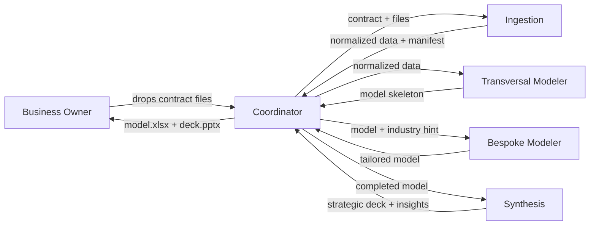

# Insignia SOP Implementation Plan

> **For agentic workers:** REQUIRED SUB-SKILL: Use superpowers:subagent-driven-development (recommended) or superpowers:executing-plans to implement this plan task-by-task. Steps use checkbox (`- [ ]`) syntax for tracking.

**Goal:** Produce a 20–25 page pre-signing SOP document for Insignia's Business Owner, drafted in English, translated to Spanish, exported as PDF — faithful to the v1 run design and the diagnostic.

**Architecture:** Single-file markdown draft (`docs/contracts/Insignia/sop/insignia-sop-en.md`), split into three parts plus appendix. Each section is a self-contained task that commits on completion. Visual assets (team diagram, journey timeline) are standalone mermaid files under `docs/contracts/Insignia/sop/assets/`. Spanish translation is a separate file; PDF is exported last.

**Tech Stack:** Markdown, mermaid for diagrams, Exa MCP for live Anthropic rate research, Pandoc or equivalent for PDF export (decision at export step).

**Sources of truth (read before every drafting task):**
- Spec: `docs/superpowers/specs/2026-04-15-insignia-sop-design.md`
- Diagnostic: `docs/contracts/Insignia/diagnostics/insignia_diagnostics.md`
- Run design: `runs/latest/design/agent-specs.json` and `runs/latest/design/system_prompts/*.md`

**Style rules (apply to every drafting task):**
- Second person, Business Owner as protagonist
- No API-speak in the body (file paths, tool IDs, model names go to the appendix)
- Human analogies for technical concepts
- Short paragraphs, short sentences
- Every numeric claim sourced (link to diagnostic, run design, or external reference)

---

## Phase 0 — Setup

### Task 0: Create the SOP workspace

**Files:**
- Create: `docs/contracts/Insignia/sop/insignia-sop-en.md` (empty stub with title + section skeleton)
- Create: `docs/contracts/Insignia/sop/assets/.gitkeep`
- Create: `docs/contracts/Insignia/sop/research/.gitkeep`

- [ ] **Step 1: Create the directory structure**

```bash
mkdir -p docs/contracts/Insignia/sop/assets docs/contracts/Insignia/sop/research
touch docs/contracts/Insignia/sop/assets/.gitkeep docs/contracts/Insignia/sop/research/.gitkeep
```

- [ ] **Step 2: Write the skeleton stub**

Create `docs/contracts/Insignia/sop/insignia-sop-en.md` containing only top-level headers (no prose) matching the spec structure: `# Insignia — Standard Operating Procedure`, then H2 headers for Part I sections 1–10, Part II agent chapters (5), Part III sections 11–13, and Appendix. Each H2 has a single placeholder line: `_To be drafted in Task N._`

- [ ] **Step 3: Commit**

```bash
git add docs/contracts/Insignia/sop/
git commit -m "scaffold Insignia SOP workspace and skeleton"
```

---

## Phase 1 — Research (blocks §9 running-cost estimate)

### Task 1: Pull live Anthropic rates via Exa

**Files:**
- Create: `docs/contracts/Insignia/sop/research/anthropic-rates.md`

- [ ] **Step 1: Run Exa research for current rates**

Use the `exa-research` skill or directly `mcp__exa__web_search_exa` + `mcp__exa__crawling_exa` against `anthropic.com/pricing` and `docs.anthropic.com` to pull:
- claude-opus-4-6 input/output per-million-token rates
- claude-sonnet-4-6 input/output per-million-token rates
- Managed Agents platform billing model (per-session? per-environment-hour? per-file-GB-month?)
- Any published beta pricing disclaimers

WebFetch alone will fail on platform.claude.com (JS-rendered SPA — see MEMORY.md). Use Exa crawl.

- [ ] **Step 2: Write the research note**

Capture verbatim rate strings, the URL and date pulled, and any ambiguity (e.g. "Managed Agents billing not yet separately published"). Format as a table the cost-estimate task can cite directly.

- [ ] **Step 3: Commit**

```bash
git add docs/contracts/Insignia/sop/research/anthropic-rates.md
git commit -m "research: Anthropic rates for SOP cost estimate"
```

### Task 2: Estimate per-agent token usage per contract

**Files:**
- Create: `docs/contracts/Insignia/sop/research/token-estimates.md`

- [ ] **Step 1: Enumerate expected turns per agent from the run design**

Read each agent's system prompt under `runs/latest/design/system_prompts/`. For each, estimate:
- System prompt token count (the prompt itself)
- Expected tool-use turns per contract (ingestion: ~10–20; transversal: ~30–60; bespoke: ~30–60 including web; synthesis: ~20–40; coordinator: ~10)
- Expected input/output token volume per turn

Methodology: take the Tafi smoke test (2 input files; 27MB CSV, scanned PDF) as the representative contract.

- [ ] **Step 2: Write the estimate table**

Columns: agent | model | input tokens | output tokens | total tokens | rate (from Task 1) | $/contract. Include explicit "estimated, not measured" disclaimer.

- [ ] **Step 3: Commit**

```bash
git add docs/contracts/Insignia/sop/research/token-estimates.md
git commit -m "research: per-agent token estimates for SOP cost section"
```

---

## Phase 2 — Visual assets

### Task 3: Team flow diagram

**Files:**
- Create: `docs/contracts/Insignia/sop/assets/team-flow.mmd`

- [ ] **Step 1: Write the mermaid diagram**

Node per agent, directed edges showing sequential flow: coordinator → ingestion → transversal_modeler → bespoke_modeler → synthesis, and return arrows for envelopes. Label each edge with the handed-off artifact (e.g. "normalized data", "model skeleton", "tailored model", "deck").



- [ ] **Step 2: Verify rendering**

Run `mmdc -i team-flow.mmd -o team-flow.png` (or paste into https://mermaid.live to eyeball). Fix any syntax issues.

- [ ] **Step 3: Commit**

```bash
git add docs/contracts/Insignia/sop/assets/team-flow.mmd
git commit -m "sop assets: team flow diagram"
```

### Task 4: Per-contract journey timeline

**Files:**
- Create: `docs/contracts/Insignia/sop/assets/journey-timeline.mmd`

- [ ] **Step 1: Write a gantt-style mermaid timeline**

Swimlanes: Business Owner, Ingestion, Transversal, Bespoke, Synthesis. Show the sequential handoffs across ~1 business day (target: 3 days end-to-end but most of that is the BO's sign-off windows). Mark the "blocked on client" branch as a conditional.

```mermaid
gantt
  title One contract, one day
  dateFormat HH:mm
  axisFormat %H:%M
  section Business Owner
    Drop files               :09:00, 10m
    Review deliverables      :16:30, 30m
  section Pipeline
    Ingestion                :09:10, 40m
    Transversal model        :09:50, 90m
    Bespoke overlay          :11:20, 120m
    Synthesis deck           :13:20, 90m
    Coordinator assembly     :14:50, 10m
```



- [ ] **Step 2: Verify rendering**

Run `mmdc` or paste into mermaid.live.

- [ ] **Step 3: Commit**

```bash
git add docs/contracts/Insignia/sop/assets/journey-timeline.mmd
git commit -m "sop assets: per-contract journey timeline"
```

---

## Phase 3 — Part I: Opening (cross-cutting sections 1–10)

Each task below drafts one section of the SOP into `docs/contracts/Insignia/sop/insignia-sop-en.md`, replacing the placeholder line.

### Task 5: §1 Executive summary

**Files:**
- Modify: `docs/contracts/Insignia/sop/insignia-sop-en.md` (§1)

- [ ] **Step 1: Draft the one-page summary**

Cover: what the pipeline does (one paragraph); the capacity shift (5–12 days → 3 days, 20 → 60+ contracts/year, sourced from diagnostic §3); one-line promise of each agent; one takeaway sentence. Target 400–500 words. Reference the team-flow diagram (Task 3) inline.

- [ ] **Step 2: Commit**

```bash
git add docs/contracts/Insignia/sop/insignia-sop-en.md
git commit -m "sop §1: executive summary"
```

### Task 6: §2 How the team works together

**Files:**
- Modify: `docs/contracts/Insignia/sop/insignia-sop-en.md` (§2)

- [ ] **Step 1: Draft**

Embed team-flow diagram. Explain the sequential flow in plain language (one contract per run; the coordinator is the project manager). Call out the "one contract at a time in v1" invariant and forward-reference the v2 batch-mode item.

- [ ] **Step 2: Commit**

```bash
git commit -am "sop §2: team flow"
```

### Task 7: §3 Where it runs

**Files:**
- Modify: `docs/contracts/Insignia/sop/insignia-sop-en.md` (§3)

- [ ] **Step 1: Draft**

Anthropic-managed cloud; each contract runs in an isolated container that's destroyed after the run; nothing persists on your or our servers. Frame "stateless per run" as a feature (no cross-contamination between clients) rather than a limitation. Source: `runs/latest/design/agent-specs.json` `environments[0].design_notes.concurrent_session_isolation` and `no_run_state_on_fs`.

- [ ] **Step 2: Commit**

```bash
git commit -am "sop §3: where it runs"
```

### Task 8: §4 Security & confidentiality

**Files:**
- Modify: `docs/contracts/Insignia/sop/insignia-sop-en.md` (§4)

- [ ] **Step 1: Draft**

Translate the CLAUDE.md "credential handling" principles into client language: we never handle your credentials directly (v2 uses MS vault-mediated OAuth); inputs live only inside the isolated container during the run; no silent data transmission; web_search on bespoke_modeler and synthesis is the only outbound path and every citation is recorded. Address data residency honestly (Anthropic's US infrastructure; note that the Business Owner should confirm that's acceptable for their clients).

- [ ] **Step 2: Commit**

```bash
git commit -am "sop §4: security and confidentiality"
```

### Task 9: §5 Determinism & reproducibility

**Files:**
- Modify: `docs/contracts/Insignia/sop/insignia-sop-en.md` (§5)

- [ ] **Step 1: Draft**

Include the determinism table verbatim from the spec. Precede with a one-paragraph intro: "LLM pipelines are not mathematically deterministic, but we engineer each agent to be as reproducible as its job allows." Follow the table with a short explanation of why synthesis *shouldn't* be fully deterministic (judgment is the value, not a bug).

| Agent | Determinism | What this means for you |
|-------|-------------|-------------------------|
| Ingestion | Near-deterministic | Same file → same normalized data |
| Transversal modeler | Deterministic math, judgment on assumption fill-ins | Same inputs → same skeleton |
| Bespoke modeler | Judgment within guardrails | Two runs may cite different valid sources; both are cited |
| Synthesis | Judgment (this is the point) | The 3–5 insights may differ; all are number-backed |

- [ ] **Step 2: Commit**

```bash
git commit -am "sop §5: determinism and reproducibility"
```

### Task 10: §6 Quality controls

**Files:**
- Modify: `docs/contracts/Insignia/sop/insignia-sop-en.md` (§6)

- [ ] **Step 1: Draft**

List the four built-in controls with a one-line example of each:
1. Excel self-validation cells — balance check, cash tie-out (source: `transversal_modeler` system prompt "balance_check" design note)
2. Missing-field halts — pipeline refuses to model on data gaps (source: `ingestion` fail-fast pattern)
3. Source-cited assumptions — every numeric assumption in the bespoke layer carries a playbook path or URL
4. Formula-only computed cells — no hard-coded subtotals (source: `transversal_modeler` formula_discipline design note)

- [ ] **Step 2: Commit**

```bash
git commit -am "sop §6: quality controls"
```

### Task 11: §7 Human oversight

**Files:**
- Modify: `docs/contracts/Insignia/sop/insignia-sop-en.md` (§7)

- [ ] **Step 1: Draft**

Three explicit moments:
1. Drop files (start of run)
2. Receive blocked envelope if data is incomplete — pipeline halts rather than guess
3. Review deck and model before forwarding to the end client

Close with: "Nothing is ever auto-sent to your client. You are the final gate."

- [ ] **Step 2: Commit**

```bash
git commit -am "sop §7: human oversight"
```

### Task 12: §8 Audit trail

**Files:**
- Modify: `docs/contracts/Insignia/sop/insignia-sop-en.md` (§8)

- [ ] **Step 1: Draft**

Name the artifacts the Business Owner can open after any run: `manifest.json` (ingestion's view), `classification.json` (how it interpreted each file), `assumption_notes.md` (every bespoke assumption with source), validation cells in the workbook, deck speaker notes with sources. Frame as: "If anyone on your side ever asks 'where did this number come from?', there's a file that answers."

- [ ] **Step 2: Commit**

```bash
git commit -am "sop §8: audit trail"
```

### Task 13: §9 Running cost estimate

**Files:**
- Modify: `docs/contracts/Insignia/sop/insignia-sop-en.md` (§9)
- Read: `docs/contracts/Insignia/sop/research/anthropic-rates.md` (from Task 1)
- Read: `docs/contracts/Insignia/sop/research/token-estimates.md` (from Task 2)

**Blocked by:** Task 1, Task 2

- [ ] **Step 1: Draft the itemized table**

Per-agent × model × rate × tokens = per-agent cost. Sum to per-contract cost. Multiply by 60 for annual projection. Add platform costs (environment runtime, file storage) from Task 1 if published; otherwise flag as "awaiting public rate disclosure".

- [ ] **Step 2: Add methodology and disclaimer**

Short paragraph: token estimates are engineering projections pre-smoke-test, not measurements. After the first live contract we'll update with actuals. Managed Agents is a beta product; rates may move.

- [ ] **Step 3: Commit**

```bash
git commit -am "sop §9: running cost estimate"
```

### Task 14: §10 v1 limits

**Files:**
- Modify: `docs/contracts/Insignia/sop/insignia-sop-en.md` (§10)

- [ ] **Step 1: Draft**

Honest list, each as "v1 does not yet: X — v2 adds: Y":
- MS Teams / OneDrive auto-intake → manual file drop today
- PowerBI dashboard refresh → manual export today
- Cross-contract memory → each contract starts fresh today
- Batch mode → one contract at a time today
- Outcome-validation rubrics → human review is the quality gate today
- Industry playbook library → web_search is the fallback today

- [ ] **Step 2: Commit**

```bash
git commit -am "sop §10: v1 limits"
```

---

## Phase 4 — Part II: Agent chapters (5 tasks)

Each chapter follows the same card template. Read the corresponding system prompt under `runs/latest/design/system_prompts/` and the matching `api_fields` + `design_notes` under `runs/latest/design/agent-specs.json` before drafting.

### Task 15: Chapter — Coordinator ("the project manager")

**Files:**
- Modify: `docs/contracts/Insignia/sop/insignia-sop-en.md` (Part II §1)

- [ ] **Step 1: Draft the card**

Sections: Role + analogy; What it reads / what it delivers; How it thinks (routing, envelope parsing, short-circuit on failure); Tools (read + write only); Why Sonnet; Determinism profile (highly deterministic routing); Security posture (no internet); Failure modes (propagates worker failures, never invents outputs); What you can verify (coordinator.log, the final envelope). Target 1.5–2 pages.

- [ ] **Step 2: Commit**

```bash
git commit -am "sop agent: coordinator chapter"
```

### Task 16: Chapter — Ingestion ("the intake clerk")

**Files:**
- Modify: `docs/contracts/Insignia/sop/insignia-sop-en.md` (Part II §2)

- [ ] **Step 1: Draft**

Same sections. Highlight PDF extraction fallback chain (pdf skill → pdfplumber → pymupdf) in plain language ("we read your files three ways; if one fails we try the next"). Failure modes: scanned-only PDFs halt the run rather than produce empty data.

- [ ] **Step 2: Commit**

```bash
git commit -am "sop agent: ingestion chapter"
```

### Task 17: Chapter — Transversal modeler ("the standard modeler")

**Files:**
- Modify: `docs/contracts/Insignia/sop/insignia-sop-en.md` (Part II §3)

- [ ] **Step 1: Draft**

Highlight the template-preservation discipline ("we never rebuild your standard sheets from scratch — we fill your template") and the formula-only rule (every subtotal is a live formula). Failure modes: balance check fails → run returns "failed" rather than silently shipping an unbalanced model.

- [ ] **Step 2: Commit**

```bash
git commit -am "sop agent: transversal modeler chapter"
```

### Task 18: Chapter — Bespoke modeler ("the industry specialist")

**Files:**
- Modify: `docs/contracts/Insignia/sop/insignia-sop-en.md` (Part II §4)

- [ ] **Step 1: Draft**

Playbook-first, web-search fallback. Every assumption carries a source. Failure modes: conflicting sources → picks midpoint, cites range. Security posture: this is one of only two agents that reaches the internet; every outbound search is logged.

- [ ] **Step 2: Commit**

```bash
git commit -am "sop agent: bespoke modeler chapter"
```

### Task 19: Chapter — Synthesis ("the strategist")

**Files:**
- Modify: `docs/contracts/Insignia/sop/insignia-sop-en.md` (Part II §5)

- [ ] **Step 1: Draft**

The "Janitorial vs Architectural AI" framing from the diagnostic — this agent is the one that moves you from producer to strategic partner. 3–5 insights, each with a number, a source cell, and a "so what." Failure modes: fragile DCF → the agent *flags* fragility rather than hides it.

- [ ] **Step 2: Commit**

```bash
git commit -am "sop agent: synthesis chapter"
```

---

## Phase 5 — Part III: Closing + Appendix

### Task 20: §11 Your workflow as the Business Owner

**Files:**
- Modify: `docs/contracts/Insignia/sop/insignia-sop-en.md` (§11)

- [ ] **Step 1: Draft**

Three steps, half a page: drop files → receive envelope → review and forward. Reference the journey timeline (Task 4).

- [ ] **Step 2: Commit**

```bash
git commit -am "sop §11: your workflow"
```

### Task 21: §12 What we need from you

**Files:**
- Modify: `docs/contracts/Insignia/sop/insignia-sop-en.md` (§12)

- [ ] **Step 1: Draft**

Input file expectations (accepted formats, naming hints, completeness expectations); turnaround commitment on clarification loops (e.g., 48h); sign-off at delivery.

- [ ] **Step 2: Commit**

```bash
git commit -am "sop §12: what we need from you"
```

### Task 22: §13 v2 roadmap

**Files:**
- Modify: `docs/contracts/Insignia/sop/insignia-sop-en.md` (§13)

- [ ] **Step 1: Draft six one-paragraph items**

Each item: name, one-paragraph description, the pain from the diagnostic it eliminates.
1. MS Teams / OneDrive automatic intake — eliminates the 4-day classification window
2. PowerBI dashboard refresh from synthesis output — eliminates recurring manual partner-view work
3. Industry playbook library — reduces web-search dependency, faster bespoke layer
4. Cross-contract memory — the pipeline remembers past-sector lessons
5. Multi-contract batch mode — removes the one-at-a-time limit
6. Outcome validation — rubric-graded quality checks before hand-off

- [ ] **Step 2: Commit**

```bash
git commit -am "sop §13: v2 roadmap"
```

### Task 23: Appendix — Technical reference

**Files:**
- Modify: `docs/contracts/Insignia/sop/insignia-sop-en.md` (Appendix)

- [ ] **Step 1: Draft**

Table per agent: name, model ID, tool list, skill list, mcp server list (empty for v1). File-path conventions from `runs/latest/design/agent-specs.json` `sessions[0]`. Environment package list from `environments[0]`. Links to Anthropic Managed Agents public docs (beta header, agents/sessions/environments endpoints).

- [ ] **Step 2: Commit**

```bash
git commit -am "sop appendix: technical reference"
```

---

## Phase 6 — Review and delivery

### Task 24: English self-review pass

**Files:**
- Modify: `docs/contracts/Insignia/sop/insignia-sop-en.md` (any fixes)

- [ ] **Step 1: Read the full draft cover-to-cover**

Check against the spec's success criteria (§"Success criteria" in `docs/superpowers/specs/2026-04-15-insignia-sop-design.md`):
1. Can a reader describe the flow in their own words?
2. Can they explain each of 5 agents?
3. Can they point pain → agent mapping?
4. Can they state the cost range?
5. Can they name 3 v2 items?
6. Can they articulate one honest limit?

- [ ] **Step 2: Check style rules**

Grep for API-speak leaks in the body (not appendix):
```bash
grep -nE 'openpyxl|mcp_servers|tool_use|claude-opus-4|claude-sonnet-4|agent_toolset' docs/contracts/Insignia/sop/insignia-sop-en.md
```
Expected: matches only inside the Appendix section.

- [ ] **Step 3: Fix issues inline, then commit**

```bash
git commit -am "sop: English self-review fixes"
```

### Task 25: Ask user to review English draft

- [ ] **Step 1: Message the user**

"English draft complete at `docs/contracts/Insignia/sop/insignia-sop-en.md`. Please review before we translate to Spanish. Flag any tone, structure, or factual concerns."

- [ ] **Step 2: Apply any requested changes**

If changes requested, fix and re-run Task 24. Otherwise proceed to Task 26.

- [ ] **Step 3: Commit any changes**

```bash
git commit -am "sop: address user review feedback"
```

### Task 26: Spanish translation

**Files:**
- Create: `docs/contracts/Insignia/sop/insignia-sop-es.md`
- Create: `docs/contracts/Insignia/sop/research/es-glossary.md`

- [ ] **Step 1: Build the glossary**

Two-column glossary (EN → ES) for recurring terms: agents' human analogies ("intake clerk" → "empleado de recepción"), AI terms (determinism, audit trail), Insignia domain terms (leave P&L, EBITDA, DCF, WACC as-is per finance convention). Target 30–50 entries.

- [ ] **Step 2: Translate**

Full translation of the English SOP. LatAm Spanish, formal "usted". Preserve all mermaid code blocks and tables untouched. Keep the glossary consistent.

- [ ] **Step 3: Self-review the Spanish**

Read cover-to-cover. Verify financial terms are correct LatAm register (not Peninsular Spanish). Check numbers and percentages are formatted per LatAm convention (comma decimal, period thousands).

- [ ] **Step 4: Commit**

```bash
git add docs/contracts/Insignia/sop/insignia-sop-es.md docs/contracts/Insignia/sop/research/es-glossary.md
git commit -m "sop: Spanish translation"
```

### Task 27: User review of Spanish draft

- [ ] **Step 1: Ask the user to review the Spanish**

"Spanish translation complete at `docs/contracts/Insignia/sop/insignia-sop-es.md`. Please review for tone, terminology, and any client-sensitive phrasing before PDF export."

- [ ] **Step 2: Apply any requested changes and commit**

```bash
git commit -am "sop: Spanish review fixes"
```

### Task 28: PDF export

**Files:**
- Create: `docs/contracts/Insignia/sop/insignia-sop-es.pdf`

- [ ] **Step 1: Render mermaid diagrams to PNG**

```bash
cd docs/contracts/Insignia/sop/assets
mmdc -i team-flow.mmd -o team-flow.png -w 1600
mmdc -i journey-timeline.mmd -o journey-timeline.png -w 1600
```

If `mmdc` isn't installed: `npm install -g @mermaid-js/mermaid-cli`.

- [ ] **Step 2: Export PDF via Pandoc**

```bash
cd docs/contracts/Insignia/sop
pandoc insignia-sop-es.md \
  -o insignia-sop-es.pdf \
  --pdf-engine=xelatex \
  --toc \
  --toc-depth=2 \
  -V geometry:margin=2.5cm \
  -V mainfont="Helvetica" \
  -V lang=es
```

If Pandoc/xelatex aren't available: fall back to rendering via VS Code's Markdown PDF extension or `md-to-pdf` (npm). Capture the exact tool used in the commit message for reproducibility.

- [ ] **Step 3: Page count check**

Expected: 20–25 pages. If under 15 or over 30, revisit section lengths before shipping.

- [ ] **Step 4: Commit**

```bash
git add docs/contracts/Insignia/sop/insignia-sop-es.pdf docs/contracts/Insignia/sop/assets/*.png
git commit -m "sop: PDF export (Spanish)"
```

### Task 29: Final handoff

- [ ] **Step 1: Tell the user**

"SOP ready at `docs/contracts/Insignia/sop/insignia-sop-es.pdf` (Spanish) with `insignia-sop-en.md` as the English source of truth. Assets and research notes under `docs/contracts/Insignia/sop/assets/` and `research/`."

- [ ] **Step 2: No further commits unless the user requests changes**

---

## Self-review

**Spec coverage:**
- Part I §1–10 → Tasks 5–14 ✓
- Part II agent chapters ×5 → Tasks 15–19 ✓
- Part III §11–13 → Tasks 20–22 ✓
- Appendix → Task 23 ✓
- Running cost estimate research dependency → Tasks 1–2 ✓
- Visual assets (team diagram, journey timeline) → Tasks 3–4 ✓
- Translation handoff → Task 26 ✓
- PDF export → Task 28 ✓
- Success-criteria check → Task 24 ✓

**Placeholder scan:** No "TBD" in drafting tasks. Task 26 step 1 has a target range (30–50 glossary entries) rather than an enumerated list — acceptable, the entries emerge from Task 24's content.

**Type consistency:** File paths consistent (`docs/contracts/Insignia/sop/insignia-sop-en.md` and `-es.md`). Mermaid files under `assets/`. Research under `research/`. Tasks 1 and 2 outputs are explicitly referenced by Task 13.

**Dependency gate:** Task 13 is explicitly blocked by Tasks 1 and 2. No other blocking chains — Phase 3 sections are independent and can be drafted in parallel if desired.
